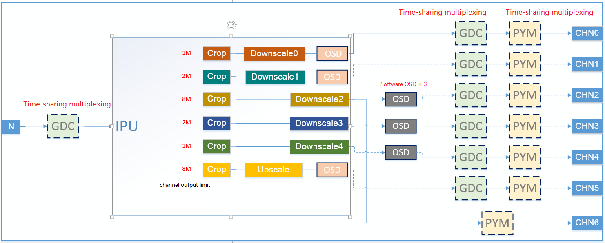
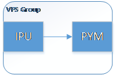
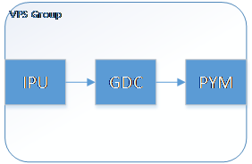
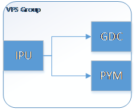
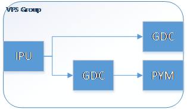
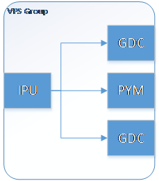

# 7.3.6 Video Processing

## Overview
`VPS (Video Process System)` is a video processing system that supports image scaling, zooming, cropping, rotation, GDC correction, frame rate control, and pyramid image output.


## Function Description
### Basic Concepts
- Group

  The `VPS` provides the concept of groups to users, and each group time-sharing multiplexes the `IPU`, `GDC`, `PYM` hardware. Multiple `VPS groups` can be cascaded for use.

- Channel

  The channel of `VPS` represents an output of `VPS`. The output channels are mainly divided into ordinary image channels and pyramid image channels. The ordinary channel outputs the single-layer data after scaling, cropping, or rotating, and the pyramid channel outputs multi-layer pyramid scaled data.


### Function Description


The `VPS` can be bound to other modules via the system control interface provided by [System Control](./system_control). It can accept inputs from the `VIN` and `VDEC` modules, and its outputs can be connected to the `VOT`, `VENC`, or another `VPS` module for more channels. Input sources are connected to `VPS`, and receivers are connected from `VPS`. Users can manage groups through the `VPS` interface, with each group allowed to bind to only one input source, and each channel capable of binding to different modules. When connecting `VPS` to `VIN`, the `HB_SYS_SetVINVPSMode` function must be called to configure the online or offline mode between `VIN` and `VPS`.



The `VPS` hardware consists of an `IPU`, a `PYM`, and two `GDC`s. It offers seven output channels (chn0 to chn6), with chn0 to chn4 supporting downsampling, chn5 enabling upsampling, and all channels capable of cropping (ROI), rotation, correction, and frame rate control. Chn6 serves as the pyramid online channel. The hardware reuses resources, with the gray block in the OSD being CPU overlay, and the three beige blocks representing hardware overlays.

**Upscaling Functionality:**

* Limitations:
  - Horizontal scaling up to 1.5x, width must be a multiple of 4, minimum 32x32, maximum 4096.
  - Vertical scaling up to 1.5x, height must be even, minimum 32x32, maximum 4096.
  - Only chn5 supports upsampling.

**Downsampling Functionality:**

* Limitations:
  - Maximum horizontal downsampling to 1/8th of the original size (greater than 1/8), minimum 32x32, maximum 4096.
  - Maximum vertical downsampling to 1/8th of the original size (greater than 1/8), minimum 32x32, maximum 4096.
  - Chn0 to chn4 support downsampling.

**IPU Channel Size Constraints:**

|Scaler| FIFO(bytes)| Resolution(pixel)|
|:-:|:-:|:-:|
|Scaler 5 (IPU US)| 4096 |8M|
|Scaler 2 (IPU DS2)| 4096 |8M|
|Scaler 1 (IPU DS1)| 2048 |2M|
|Scaler 3 (IPU DS3)| 2048 |2M|
|Scaler 4 (IPU DS4)| 1280 |1M|
|Scaler 0 (IPU DS0)| 1280 |1M|

**Cropping Functionality:**

`VPS` allows cropping of input images, selecting a ROI region for resizing or shrinking.

**PYM Pyramid Processing Functionality:**

* Input:
  - Maximum width: 4096
  - Maximum height: 4096
  - Minimum width: 64
  - Minimum height: 64
* Output:
  - Maximum width: 4096
  - Maximum height: 4096
  - Minimum width: 48
  - Minimum height: 32
* Layers:
  - 24 layers for shrinking (0-23, with Base layers at 0, 4, 8, 12, 16, 20, and ROI layers based on Base layers)
  - 6 layers for zooming (24-29, fixed scales: 1.28x, 1.6x, 2x, 2.56x, 3.2x, 4x)
  - Non-online channels: PYM channels 0-5

* One `PYM` can be used per group.

### Cautionary Notes:

- `PYM` hardware requires at least BASE0 and BASE4 layers to be enabled.

- When using the online input (chn6), the total output data volume of all PYM ds layers (0-23) must not exceed 2.5 times the input data volume, and the sum of US layer widths (24-29) should not exceed the input width, otherwise, there may be unknown risks.

- After binding `IPU` to `PYM`, it cannot be further bound to `VOT`, `VPS`, or `VENC` modules.

**Rotation Functionality:**

- `VPS` supports 90°, 180°, and 270° rotations.
- Supports either Group rotation (all channels affected) or Channel rotation (rotation of specific chn0-chn5 pairs).
- PYM-processed channels cannot be rotated.

**GDC Correction Functionality:**

- `VPS` accepts distortion correction files for input image correction.
- Supports either Group correction (all channels affected) or Channel correction (specific chn0-chn5 pairs).
- Channels can be corrected independently.

**Frame Rate Control Functionality:**

- Channels 0-5 of `VPS` support frame rate control, allowing any frame rate up to or equal to the input frame rate.

## API Reference
### HB_VPS_CreateGrp
**Function Declaration:**
```c
int HB_VPS_CreateGrp(int VpsGrp, const VPS_GRP_ATTR_S *grpAttr);
```
**Function Description:**
> Creates a VPS Group

**Parameter Descriptions:**

| Parameter Name | Description | Input/Output |
| :------------- | :---------- | :---------- |
|  VpsGrp        | Group ID     |   Input     |
| grpAttr        | Group attribute pointer | Input |

**Return Values:**

| Return Value | Description |
| :---------: | ----------- |
|    0       | Success     |
| Non-zero    | Failure     |

**Cautionary Note:**
> Up to 8 groups can be created. Group attributes mainly include input width, height, and GDC buffer depth.

**Reference Code:**
> VPS reference code

### HB_VPS_DestroyGrp
**Function Declaration:**
```c
int HB_VPS_DestroyGrp(int VpsGrp);
```
**Function Description:**
> Destroys a VPS Group

**Parameter Descriptions:**

| Parameter Name | Description | Input/Output |
| :------------- | :---------- | :---------- |
|  VpsGrp        | Group ID     |   Input     |

**Return Values:**

| Return Value | Description |
| :---------: | ----------- |
|    0       | Success     |
| Non-zero    | Failure     |

**Cautionary Note:**
> The group must already exist.

**Reference Code:**
> None

### HB_VPS_StartGrp
**Function Declaration:**
```c
int HB_VPS_StartGrp(int VpsGrp);
```
**Function Description:**
> Starts processing for a VPS Group

**Parameter Descriptions:**

| Parameter Name | Description | Input/Output |
| :------------- | :---------- | :---------- |
|  VpsGrp        | Group ID     |   Input     |

**Return Values:**

| Return Value | Description |
| :---------: | ----------- |
|    0       | Success     |
| Non-zero    | Failure     |

**Cautionary Note:**
> The group must already be created.

**Reference Code:**
> VPS reference code

### HB_VPS_StopGrp
**Function Declaration:**
```c
int HB_VPS_StopGrp(int VpsGrp);
```
**Function Description:**
> Stops processing for a VPS Group

**Parameter Descriptions:**

| Parameter Name | Description |
| :------------- | :---------- |
|  VpsGrp        | Group ID     |

**Return Values:**

| Return Value | Description |
| :---------: | ----------- |
|    0       | Success     |
| Non-zero    | Failure     |

**Cautionary Note:**
> The group must already be created and started.

**Reference Code:**
> VPS reference code


### HB_VPS_GetGrpAttr
【Function Declaration】
```c
int HB_VPS_GetGrpAttr(int VpsGrp, VPS_GRP_ATTR_S *grpAttr);
```
【Function Description】
> Get the attributes of VPS Group.

【Parameter Description】

| Parameter Name | Description              | Input/Output |
| :------------: | :----------------------- | :----------: |
|    VpsGrp      | Group Number             |    Input     |
|    grpAttr     | Pointer to attribute struct |    Output    |

【Return Value】

| Return Value | Description |
| :----------: | ----------- |
|      0       | Success     |
|   Non-zero   | Failure     |

【Note】
> None

【Reference Code】
> None

### HB_VPS_SetGrpAttr
【Function Declaration】
```c
int HB_VPS_SetGrpAttr(int VpsGrp, const VPS_GRP_ATTR_S *grpAttr);
```
【Function Description】
> Set the attributes of VPS Group.

【Parameter Description】

| Parameter Name | Description              | Input/Output |
| :------------: | :----------------------- | :----------: |
|    VpsGrp      | Group Number             |    Input     |
|    grpAttr     | Pointer to attribute struct |    Input    |【Return Value】

| Return Value | Description |
| :----------: | ----------- |
|      0       | Success     |
|   Non-zero   | Failure     |

【Notes】

> No

【Reference Code】

> VPS Reference Code

### HB_VPS_SetGrpRotate
【Function Declaration】
```c
int HB_VPS_SetGrpRotate(int VpsGrp, ROTATION_E enRotation);
```
【Function Description】
> Set the rotation function for VPS Group, rotate all outputs of VPS

【Parameter Description】

|   Parameter Name   |  Description   | Input/Output |
| :----------------: | :------------ | :----------: |
|      VpsGrp        |   Group number |    Input     |
|    enRotation      |  Rotation parameter |   Input    |

【Return Value】

| Return Value | Description |
| :----------: | ----------- |
|      0       | Success     |
|   Non-zero   | Failure     |

【Notes】

> This interface needs to be called before HB_VPS_SetChnAttr, disable ChnRotate after enabling GroupRotate; isp binding ipu must be in offline mode

【Reference Code】

> VPS Reference Code


### HB_VPS_GetGrpRotate
**Function Declaration**
```c
int HB_VPS_GetGrpRotate(int VpsGrp, ROTATION_E *enRotation);
```
**Function Description**
> Retrieves the rotation feature property for a VPS Group

**Parameter Descriptions**

| Parameter Name | Description                     | Input/Output |
| :------------- | :------------------------------ | :----------: |
|   VpsGrp       | Group ID                        |     Input    |
| enRotation     | Pointer to rotation parameter   |     Output   |

**Return Values**

| Return Value | Description                  |
| :---------: | ----------------------------- |
|     0      | Success                       |
| Non-zero    | Failure                       |

**Note**
> None

**Reference Code**
> No reference code provided

### HB_VPS_SetGrpRotateRepeat
**Function Declaration**
```c
int HB_VPS_SetGrpRotateRepeat(int VpsGrp, ROTATION_E enRotation);
```
**Function Description**
> Sets dynamic group rotation: This interface saves the channel configuration for the current group and subsequent bound VPS groups. It automatically recalculates dimensions, ROI regions, initializes the group, and rebinds VIN based on the provided `enRotation`.

**Parameter Descriptions**

| Parameter Name | Description                            | Input/Output |
| :------------- | :-------------------------------------- | :----------: |
|   VpsGrp       | Group ID                               |     Input    |
| enRotation     | Rotation parameter                     |     Input    |

**Return Values**

| Return Value | Description                           |
| :---------: | -------------------------------------- |
|     0      | Success                                |
| Non-zero    | Failure                                |

**Note**
> This interface is not supported for scenarios with PYM configuration.

**Reference Code**
> No reference code provided

### HB_VPS_SetGrpGdc
**Function Declaration**
```c
int HB_VPS_SetGrpGdc(int VpsGrp, char* buf_addr, uint32_t buf_len, ROTATION_E enRotation)
```
**Function Description**
> Sets the GDC correction function for a VPS Group, ensuring all outputs from VPS have correction effects applied.

**Parameter Descriptions**

| Parameter Name | Description                                       | Input/Output |
| :------------- | :------------------------------------------------ | :----------: |
|   VpsGrp       | Group ID                                          |     Input    |
|  buf_addr      | Address of the correction file                    |     Input    |
|  buf_len       | Length of the correction file                      |     Input    |
| enRotation     | Rotation parameter                                 |     Input    |

**Return Values**

| Return Value | Description                             |
| :---------: | ---------------------------------------- |
|     0      | Success                                  |
| Non-zero    | Failure                                  |

**Note**
> This interface must be called before HB_VPS_SetChnAttr. Different correction bin files are required based on the lens, distortion, and dimensions.

**Reference Code**
> VPS Reference Code

### HB_VPS_SendFrame
**Function Declaration**
```c
int HB_VPS_SendFrame(int VpsGrp, void* videoFrame, int ms);
```
**Function Description**
> Sends data to VPS

**Parameter Descriptions**

| Parameter Name | Description                                                                                                      | Input/Output |
| :------------- | :-------------------------------------------------------------------------------------------------------- | :----------: |
|   VpsGrp       | Group ID                                                                                                   |     Input    |
| videoFrame     | Pointer to image data; the VPS feedback data structure is of type hb_vio_buffer_t;                         |     Input    |
|     ms        | Timeout parameter; -1 for blocking interface, 0 for non-blocking, positive values for timeout in milliseconds (ms) |     Input    |

**Return Values**

| Return Value | Description |
| :---------: | :---------: |
|     0      | Success     |
| Non-zero    | Failure     |

**Note**
> None

**Reference Code**
> VPS Reference Code


### HB_VPS_SetChnAttr
【Function Declaration】
```c
int HB_VPS_SetChnAttr(int VpsGrp, int VpsChn, const VPS_CHN_ATTR_S *chnAttr);
```
【Function Description】
> Set the attributes of VPS channel (set the output size of a specific channel in IPU)

【Parameter Description】

| Parameter Name | Description       | Input/Output |
| :------------: | :---------------- | :----------: |
|     VpsGrp     | Group number      |    Input     |
|     VpsChn     | Channel number    |    Input     |
|    chnAttr     | Channel attribute |    Input     |

【Return Value】

| Return Value | Description |
| :----------: | :---------: |
|      0       |   Success   |
|    Non-zero  |   Failure   |

【Notice】
> This interface supports dynamically configuring the output size of IPU. Dynamic configuration needs to call this interface after StartGrp. The new size for dynamic configuration cannot be larger than the initial configuration size. If you need to change from a smaller size to a larger size after starting, you need to call this interface twice before StartVps, passing the maximum size for the first time and the minimum size for the second time.

【Reference Code】
> VPS reference code

### HB_VPS_GetChnAttr
【Function Declaration】
```c
int HB_VPS_GetChnAttr(int VpsGrp, int VpsChn, VPS_CHN_ATTR_S *chnAttr);
```
【Function Description】
> Get the attributes of VPS channel

【Parameter Description】

| Parameter Name | Description       | Input/Output |
| :------------: | :---------------- | :----------: |
|     VpsGrp     | Group number      |    Input     |
|     VpsChn     | Channel number    |    Input     |
|    chnAttr     | Channel attribute |    Output    |【Return Value】

| Return Value | Description |
| :----------: | :---------: |
|      0       |  Successful |
|    Non-zero  |   Failed    |

【Notes】
> None

【Reference Code】
> None

### HB_VPS_EnableChn
【Function Declaration】
```c
int HB_VPS_EnableChn(int VpsGrp, int VpsChn);
```
【Function Description】
> Enable the VPS channel

【Parameter Description】

|  Parameter Name |   Description   |  Input/Output  |
| :-------------: | :-------------: | :------------: |
|     VpsGrp      |   Group number  |      Input     |
|     VpsChn      |   Channel number|      Input     |

【Return Value】

| Return Value | Description |
| :----------: | :---------: |
|      0       |  Successful |
|    Non-zero  |   Failed    |

【Notes】
> If the channel is not enabled, the GetChnFrame interface cannot obtain images.

【Reference Code】
> VPS reference code


### HB_VPS_DisableChn
**Function Declaration**
```c
int HB_VPS_DisableChn(int VpsGrp, int VpsChn);
```
**Function Description**
> Disable a VPS channel

**Parameter Descriptions**

| Parameter Name | Description | Input/Output |
| :-------------: | :---------- | :----------: |
|      VpsGrp     | Group ID    |      Input   |
|      VpsChn     | Channel ID  |      Input   |

**Return Values**

| Return Value | Description |
| :---------: | :---------: |
|       0     | Success    |
| Non-zero   | Failure    |

**Caution**
> None

**Reference Code**
> VPS Reference Code

### HB_VPS_SetChnRotate
**Function Declaration**
```c
int HB_VPS_SetChnRotate(int VpsGrp, int VpsChn, ROTATION_E enRotation);
```
**Function Description**
> Set the image rotation angle for a VPS channel

**Parameter Descriptions**

| Parameter Name | Description | Input/Output |
| :-------------: | :---------- | :----------: |
|      VpsGrp     | Group ID    |      Input   |
|      VpsChn     | Channel ID  |      Input   |
|   enRotation   | Rotation Type |      Input   |

**Return Values**

| Return Value | Description |
| :---------: | :---------: |
|       0     | Success    |
| Non-zero   | Failure    |

**Caution**
> SetChnRotate must be called after SetChnAttr, and up to two CHNs can be rotated simultaneously. It is also supported after startup for dynamic channel rotation control.

**Reference Code**
> VPS Reference Code

### HB_VPS_GetChnRotate
**Function Declaration**
```c
int HB_VPS_GetChnRotate(int VpsGrp, int VpsChn, ROTATION_E *enRotation);
```
**Function Description**
> Retrieve the image rotation property for a VPS channel

**Parameter Descriptions**

| Parameter Name | Description | Input/Output |
| :-------------: | :---------- | :----------: |
|      VpsGrp     | Group ID    |      Input   |
|      VpsChn     | Channel ID  |      Input   |
|   enRotation   | Rotation Type |     Output   |

**Return Values**

| Return Value | Description |
| :---------: | :---------: |
|       0     | Success    |
| Non-zero   | Failure    |

**Caution**
> None

**Reference Code**
> N/A


### HB_VPS_SetChnGdc
**Function Declaration**
```c
int HB_VPS_SetChnGdc(int VpsGrp, int VpsChn, char* buf_addr, uint32_t buf_len, ROTATION_E enRotation)
```
**Function Description**
> Sets the GDC correction feature for a VPS channel

**Parameter Descriptions**

| Parameter Name | Description        | Input/Output |
| :------------- | :----------------- | :----------: |
|   VpsGrp       | Group ID           |    Input    |
|   VpsChn       | Channel ID         |    Input    |
|  buf_addr      | Correction file address |   Input    |
|  buf_len       | Correction file length |   Input    |
| enRotation     | Rotation parameter |   Input    |

**Return Values**

| Return Value | Description |
| :---------: | :---------: |
|    0       | Success    |
| Non-zero   | Failure    |

**Note**
> This interface must be called after HB_VPS_SetChnAttr, and at most two CHNs can be corrected simultaneously. Different lenses, distortions, and dimensions require different calibration bin files.

**Reference Code**
> VPS reference code

### HB_VPS_UpdateGdcSize
**Function Declaration**
```c
int HB_VPS_UpdateGdcSize(int VpsGrp, int VpsChn, uint16_t out_width, uint16_t out_height)
```
**Function Description**
> Updates the GDC correction output size (the default input and output sizes for GDC are the same, but this interface allows changing the GDC output size)

**Parameter Descriptions**

| Parameter Name | Description      | Input/Output |
| :------------- | :--------------- | :----------: |
|   VpsGrp       | Group ID         |    Input    |
|   VpsChn       | Channel ID       |    Input    |
| out_width      | Output width     |    Input    |
| out_height     | Output height    |    Input    |

**Return Values**

| Return Value | Description |
| :---------: | :---------: |
|    0       | Success    |
| Non-zero   | Failure    |

**Note**
> This interface should be called after HB_VPS_SetChnGdc and HB_VPS_SetGrpGdc. The provided output size must match the calibration bin file. The output dimensions cannot be larger than the current GDC input size.

**Reference Code**
> Scenario where GDC correction output size differs from input in a group:
```c
    ret = HB_VPS_SetGrpGdc(grp_id, bin_buf, buf_len, degree);
    ret = HB_VPS_UpdateGdcSize(grp_id, 0, 1280, 720);
```
> Scenario where GDC correction output size differs from input in a channel:
```c
    ret = HB_VPS_SetChnGdc(grp_id, chn_id, bin_buf, buf_len, degree);
    ret = HB_VPS_UpdateGdcSize(grp_id, 0, 1280, 720);
```


### HB_VPS_SetChnCrop
**Function Declaration**
```c
int HB_VPS_SetChnCrop(int VpsGrp, int VpsChn, const VPS_CROP_INFO_S *cropInfo)
```
**Function Description**
> Configures the cropping for a VPS channel.

**Parameter Descriptions**

| Parameter Name | Description      | Input/Output |
| :------------: | :--------------- | :---------: |
|    VpsGrp      | Group ID         |    Input    |
|    VpsChn      | Channel ID       |    Input    |
|  cropInfo     | Crop properties |    Input    |

**Return Values**

| Return Value | Description |
| :---------: | :---------- |
|     0      | Success     |
| Non-zero    | Failure     |

**Note**
> Call this function after HB_VPS_SetChnAttr; the ROI region must be within the IPU input size.

**Reference Code**
> VPS Reference Code

### HB_VPS_GetChnCrop
**Function Declaration**
```c
int HB_VPS_GetChnCrop(int VpsGrp, int VpsChn, VPS_CROP_INFO_S *cropInfo)
```
**Function Description**
> Retrieves the fixed cropping settings for a VPS channel.

**Parameter Descriptions**

| Parameter Name | Description      | Input/Output |
| :------------: | :--------------- | :---------: |
|    VpsGrp      | Group ID         |    Input    |
|    VpsChn      | Channel ID       |    Input    |
|  cropInfo     | Crop properties |    Output   |

**Return Values**

| Return Value | Description |
| :---------: | :---------- |
|     0      | Success     |
| Non-zero    | Failure     |

**Note**
> No additional notes.

**Reference Code**
> None

### HB_VPS_SetChnFrameRate
**Function Declaration**
```c
int HB_VPS_SetChnFrameRate(int VpsGrp, int VpsChn, FRAME_RATE_CTRL_S *frameRate)
```
**Function Description**
> Sets the frame rate for a VPS channel.

**Parameter Descriptions**

| Parameter Name         | Description                     | Input/Output |
| :---------------------: | :------------------------------ | :---------: |
|          VpsGrp         | Group ID                        |    Input    |
|          VpsChn         | Channel ID                      |    Input    |
|      frameRate        | Frame rate control structure |    Input    |

**Return Values**

| Return Value | Description |
| :---------: | :---------- |
|     0      | Success     |
| Non-zero    | Failure     |

**Note**
> No additional notes.

**Reference Code**
> None


### HB_VPS_TriggerSnapFrame
**Function Declaration**
```c
int HB_VPS_TriggerSnapFrame(int VpsGrp, int VpsChn, uint32_t frameCnt)
```
**Function Description**
> Trigger snapshot frames; Mark frameCnt frames starting from the current one.

**Parameter Descriptions**

| Parameter Name | Description                              | Input/Output |
| :------------- | :---------------------------------------- | :---------: |
|    VpsGrp      | Group number                             |    Input   |
|    VpsChn      | Channel number                            |    Input   |
|   frameCnt     | Number of frames to capture             |    Input   |

**Return Values**

| Return Value | Description |
| :----------: | :---------: |
|      0       | Success    |
| Non-zero    | Failure    |

**Note**
> Must be called after initialization.

**Reference Code**
> No reference code provided.

### HB_VPS_GetChnFrame
**Function Declaration**
```c
int HB_VPS_GetChnFrame(int VpsGrp, int VpsChn, void *videoFrame, int ms)
```
**Function Description**
> Retrieve a processed image frame from a channel

**Parameter Descriptions**

| Parameter Name | Description                                                                                           | Input/Output |
| :------------- | :-------------------------------------------------------------------------------------------------- | :---------: |
|    VpsGrp      | Group number                                                                                           |    Input   |
|    VpsChn      | Channel number                                                                                        |    Input   |
|  videoFrame   | Pointer to the image data structure (hb_vio_buffer_t for normal BUF structure, pym_buffer_t for pyramid BUF structure) |    Output  |
|        ms      | Timeout parameter<br/>-1 for blocking interface<br/>0 for non-blocking interface<br/>Positive value for timeout in milliseconds (ms) |    Input   |

**Return Values**

| Return Value | Description |
| :----------: | :---------: |
|      0       | Success    |
| Non-zero    | Failure    |

**Note**
> The retrieved image structure can be either a normal BUF structure (hb_vio_buffer_t) or a pyramid BUF structure (pym_buffer_t).

**Reference Code**
> VPS Reference Code (not provided)


### HB_VPS_GetChnFrame_Cond
**Function Declaration**
```c
int HB_VPS_GetChnFrame_Cond(int VpsGrp, int VpsChn, void *videoFrame, int ms, int time);
```
**Function Description**
> Retrieves a processed image from the channel conditionally.

**Parameter Descriptions**

| Parameter Name | Description                                                                                             | Input/Output |
| :------------- | :------------------------------------------------------------------------------------------------------- | :----------: |
|   VpsGrp       | Group ID                                                                                                 |      Input   |
|   VpsChn       | Channel number                                                                                            |      Input   |
| videoFrame    | Pointer to the image data                                                                                  |     Output   |
|      ms        | Timeout parameter<br/>-1 for blocking interface<br/>0 for non-blocking interface<br/>Positive value for timeout in milliseconds (ms) |      Input   |
|       time      | Time condition: 0 means discard old frames and wait for a new one; other values are not supported yet. |      Input   |

**Return Values**

| Return Value | Description |
| :---------: | :---------: |
|     0      | Success    |
| Non-zero    | Failure    |

**Note**
> The retrieved image structure can be either a normal BUF structure (hb_vio_buffer_t) or a pyramid BUF structure (pym_buffer_t).

**Reference Code**
> VPS Reference Code (not included here as it would typically be a part of the implementation and not shown in the documentation)


### HB_VPS_ReleaseChnFrame
【Function Declaration】
```c
int HB_VPS_ReleaseChnFrame(int VpsGrp, int VpsChn, void *videoFrame);
```
【Function Description】
> Release a frame of channel image.

【Parameter Description】

| Parameter Name | Description | Input/Output |
| :------------: | :------- | :--------: |
|      VpsGrp    | Group number |   Input    |
|     VpsChn     | Channel number |   Input    |
|   videoFrame   | Image information |   Input    |

【Return Value】

| Return Value | Description |
| :----------: | :--------- |
|       0      | Success    |
|   Non-zero   | Failure    |

【Note】
> None.【Reference Code】
> VPS reference code

### HB_VPS_SetPymChnAttr
【Function Declaration】
```c
int HB_VPS_SetPymChnAttr(int VpsGrp, int VpsChn, const VPS_PYM_CHN_ATTR_S *pymChnAttr);
```
【Function Description】
> Set pyramid channel attributes

【Parameter Description】

| Parameter Name | Description           | Input/Output |
| :------------: | :-------------------- | :----------: |
|    VpsGrp      | Group number          |    Input     |
|    VpsChn      | Channel number        |    Input     |
|  pymChnAttr    | Pyramid channel attributes pointer |    Input     |

【Return Value】

| Return Value | Description |
| :----------: | ----------- |
|     0        | Success     |
|   Non-zero   | Failure     |

【Notes】
1) This interface supports dynamically configuring the output size of PYM roi layer. It needs to be called after StartGrp, and the new roi size configured dynamically cannot be larger than the size configured for the first initialization. If it is necessary to change from a smaller size to a larger size after startup, this interface needs to be called twice before StartVps, passing the maximum size the first time and the minimum size the second time.
2) This interface also supports dynamically configuring the input size of PYM, which is only valid during PYM feedback and supports changing the src size from large to small after StartGrp.

【Reference Code】
> VPS reference code


### HB_VPS_GetPymChnAttr
**Function Declaration**
```c
int HB_VPS_GetPymChnAttr(int VpsGrp, int VpsChn, VPS_PYM_CHN_ATTR_S *pymChnAttr);
```
**Function Description**
> Retrieves the pyramid channel attribute.

**Parameter Descriptions**

| Parameter Name | Description | Input/Output |
| :-------------: | ----------- | -----------: |
|    VpsGrp      | Group ID    |       Input |
|    VpsChn      | Channel ID  |       Input |
| pymChnAttr    | Pyramid chan attr pointer |       Output |

**Return Values**

| Return Value | Description |
| :---------: | -----------: |
|      0      |      Success     |

**Notes**
> None

**Reference Code**
> None

### HB_VPS_ChangePymUs
**Function Declaration**
```c
int HB_VPS_ChangePymUs(int VpsGrp, uint8_t us_num, uint8_t enable);
```
**Function Description**
> Enables or disables a specific US layer in the pym.

**Parameter Descriptions**

| Parameter Name | Description | Input/Output |
| :-------------: | ----------- | -----------: |
|    VpsGrp      | Group ID    |       Input |
|    us_num      | Pyramid US layer |       Input |
|    enable      | Enable/disable flag |       Input |

**Return Values**

| Return Value | Description |
| :---------: | -----------: |
|      0      |      Success     |

**Notes**
> None

**Reference Code**
> None

### HB_VPS_GetChnFd
**Function Declaration**
```c
int HB_VPS_GetChnFd(int VpsGrp, int VpsChn);
```
**Function Description**
> Retrieves the device file descriptor for a VPS channel, which can be used for select monitoring. After a select return, images can be directly obtained using the getChnFrame interface.

**Parameter Descriptions**

| Parameter Name | Description    | Input/Output |
| :-------------: | :------------- | :-------: |
|    VpsGrp      | Group ID      |   Input    |
|    VpsChn      | Channel ID    |   Input    |

**Return Values**

| Return Value | Description |
| :---------: | -----------: |
| Positive value | Success |
| Negative value | Failure |

**Notes**
> None

**Reference Code**
> None

### HB_VPS_CloseChnFd
**Function Declaration**
```c
int HB_VPS_CloseChnFd(void);
```
**Function Description**
> Closes all channel file descriptors within the VPS.

**Parameter Descriptions**
> None

**Return Values**

| Return Value | Description |
| :---------: | -----------: |
|      0      |      Success     |
| Non-zero    |      Failure     |

**Notes**
> None

**Reference Code**
> None


### VPS Reference Code
```c
    grp_attr.maxW = 1280;
    grp_attr.maxH = 720;
    ret = HB_VPS_CreateGrp(grp_id, &grp_attr);

    grp_attr.maxW = 1920;
    grp_attr.maxH = 1080;
    ret = HB_VPS_SetGrpAttr(grp_id, &grp_attr);

    ret = HB_VPS_SetGrpRotate(grp_id, ROTATION_90);
    ret = HB_VPS_SetGrpGdc(grp_id, bin_buf, bin_len, ROTATION_90);
    chn_attr.enScale = 1;
    chn_attr.width = 1280;
    chn_attr.height = 720;
    chn_attr.frameDepth = 8;
    ret = HB_VPS_SetChnAttr(grp_id, chn_id, &chn_attr);

    chn_crop_info.en = 1;
    chn_crop_info.cropRect.x = 0;
    chn_crop_info.cropRect.y = 0;
    chn_crop_info.cropRect.width = 1280;
    chn_crop_info.cropRect.height = 720;
    ret = HB_VPS_SetChnCrop(grp_id, chn_id, &chn_crop_info);

    ret = HB_VPS_EnableChn(grp_id, chn_id);

    ret = HB_VPS_SetChnRotate(grp_id, chn_id, ROTATION_90);

    ret = HB_VPS_SetChnGdc(grp_id, chn_id, bin_buf, bin_len, ROTATION_90);

    pym_chn_attr.timeout = 2000;
    pym_chn_attr.ds_layer_en = 24;
    pym_chn_attr.us_layer_en = 0;
    pym_chn_attr.frame_id = 0;
    pym_chn_attr.frameDepth = 8;
    ret = HB_VPS_SetPymChnAttr(grp_id, pym_chn, &pym_chn_attr);

    ret = HB_VPS_StartGrp(grp_id);

    ret = HB_VPS_SendFrame(grp_id, feedback_buf, 1000);
    ret = HB_VPS_GetChnFrame(grp_id, chn_id, &out_buf, 2000);
    ret = HB_VPS_ReleaseChnFrame(grp_id, chn_id, &out_buf);
    ret = HB_VPS_DisableChn(grp_id, chn_id);
    ret = HB_VPS_StopGrp(grp_id);
    ret = HB_VPS_DestroyGrp(grp_id);
```    

### VPS Interface Call Flow
The VPS initialization interface mainly consists of Group initialization and Channel initialization. The Group interface can be seen as a global configuration, where Group attributes apply to the entire VPS output. On the other hand, Channel interfaces are used for configuring separate output channels individually, with properties set only for the current channel. When initializing, you need to first configure Group properties, followed by the properties for each individual channel.


### VPS Scenario Usage Guide
The VPS internally consists of four modules: one IPU, one PYM, and two GDCs. These modules are dynamically bound together based on the order of interface calls. It can run individually or in combination with multiple modules. The sequence of interface calls for different connection relationships is as follows:


If only one module IPU is used, after creating the Group, you need to call HB_VPS_SetChnAttr. If multiple channels need to be output from IPU, then you need to call this interface multiple times.


If only the GDC module is used, after creating the Group, you need to call HB_VPS_SetGrpGdc/Rotate interface.


If only the PYM module is used, after creating the Group, you need to call HB_VPS_SetPymChnAttr interface.



When IPU is the first module and PYM is the second module, after creating the Group, you need to call HB_VPS_SetChnAttr first and then call HB_VPS_SetPymChnAttr.


When GDC comes before IPU, you need to call HB_VPS_SetGrpGdc/Rotate first and then call HB_VPS_SetChnAttr.


When GDC comes before PYM, you need to call HB_VPS_SetGrpGdc/Rotate first and then call HB_VPS_SetPymChnAttr.


When IPU comes before GDC, you need to call HB_VPS_SetChnAttr first and then call HB_VPS_SetChnGdc/Rotate.



If IPU comes before GDC and then PYM, you need to call HB_VPS_SetChnAttr first, then call HB_VPS_SetChnGdc/Rotate, and finally call HB_VPS_SetPymChnAttr.



If multiple channels output from IPU need to be connected to GDC and PYM separately, then you need to call HB_VPS_SetChnAttr(chnA), HB_VPS_SetChnAttr(chnB), and then HB_VPS_SetChnGdc/Rotate(chnA), and finally HB_VPS_SetPymChnAttr(chnB).



You need to call HB_VPS_SetChnAttr(chnA), HB_VPS_SetChnAttr(chnB), then HB_VPS_SetChnGdc/Rotate(chnA), HB_VPS_SetChnGdc/Rotate(chnB), and finally HB_VPS_SetPymChnAttr(chnB).



You need to call HB_VPS_SetChnAttr(chnA), HB_VPS_SetChnAttr(chnB), HB_VPS_SetChnAttr(chnC), then HB_VPS_SetChnGdc/Rotate(chnA), HB_VPS_SetPymChnAttr(chnB), and HB_VPS_SetChnGdc/Rotate(chnC).


If all four modules in VPS need to be run together, you need to call HB_VPS_SetGrpGdc, HB_VPS_SetChnAttr(chnA), HB_VPS_SetChnRotate(chnA), and HB_VPS_SetPymChnAttr(chnA).

## Data Structure
### HB_VPS_GRP_ATTR_S
【Structure Definition】
```c
// Define the structure of VPS group attributes
typedef struct HB_VPS_GRP_ATTR_S {
    uint32_t    maxW;
    uint32_t    maxH;
    uint8_t     frameDepth;
    int         pixelFormat;
} VPS_GRP_ATTR_S;
```

【Function Description】
> Structure for VPS group attributes

【Member Description】

|   Member   |                        Description                        |
| :--------: | :-------------------------------------------------------: |
|    maxW    |               Maximum width of input image in VPS               |
|    maxH    |               Maximum height of input image in VPS             |
| frameDepth | Number of buffers allocated by Gdc. If VPS is bound with VOT, frameDepth should not be greater than 6. The actual number of input buffers for IAR is 8, and for GDC, it is frameDepth + 2. In IAR, the index sent by GDC (starting from 0) cannot be greater than or equal to 8. |
| pixelFormat |   Pixel format (VPS only supports nv12 format, current parameter reserved)   |

### HB_RECT_S
【Structure Definition】
```c
typedef struct HB_RECT_S {
    uint16_t    x;
    uint16_t    y;
    uint16_t    width;
    uint16_t    height;
} RECT_S;
```
【Function Description】
> Define a rectangular region

【Member Description】

|  Member  |  Description  |
| :------: | :-----------: |
|    x     | Starting x coordinate |
|    y     | Starting y coordinate |
|  width   |   Image width  |
|  height  |  Image height  |

### HB_VPS_CROP_INFO_S
【Structure Definition】
```c
typedef HB_VPS_CROP_INFO_S {
    bool        en;
    RECT_S      cropRect;
} VPS_CROP_INFO_S;
```
【Function Description】【Member Description】

|   Member   |                  Meaning                  |
| :--------: | :---------------------------------------: |
|    width   |           Width of the image output        |
|   height   |           Height of the image output       |


### HB_FRAME_RATE_CTRL_S
**Structure Definition**
```c
typedef struct HB_FRAME_RATE_CTRL_S {
    uint32_t srcFrameRate;
    uint32_t dstFrameRate;
} FRAME_RATE_CTRL_S;
```
**Function Description**
> Frame rate control structure, where dstFrameRate must not exceed srcFrameRate.

**Member Descriptions**

|   Member   |         Meaning         |
| :--------: | :----------------------: |
| srcFrameRate | Input video frame rate |
| dstFrameRate | Target video frame rate |

### HB_VPS_CHN_ATTR_S
**Structure Definition**
```c
typedef struct HB_VPS_CHN_ATTR_S {
    uint32_t width;
    uint32_t height;
    int pixelFormat;
    uint8_t enMirror;
    uint8_t enFlip;
    uint8_t enScale;
    uint32_t frameDepth;
    FRAME_RATE_CTRL_S frameRate;
} VPS_CHN_ATTR_S;
```
**Function Description**
> Structure for channel output attributes.

**Member Descriptions**

|   Member   |                             Meaning                             |
| :--------: | :----------------------------------------------------------: |
|   width    | Output image width |
|   height   | Output image height |
| pixelFormat | Pixel format (VPS currently only supports NV12) |
| enMirror   | Mirror enable; VPS does not support this, use HB_VIN_CtrlPipeMirror for horizontal mirroring |
|   enFlip    | Flip enable; VPS does not support this, sensor flipping is needed |
|   enScale   | Scaling enable |
| frameDepth | Image queue length |
|  frameRate  | Frame rate control (this frame rate is not effective, use HB_VPS_SetChnFrameRate to implement frame rate control) |

### HB_ROTATION_E
**Structure Definition**
```c
typedef enum HB_ROTATION_E {
    ROTATION_0      = 0,
    ROTATION_90     = 1,
    ROTATION_180    = 2,
    ROTATION_270    = 3,
    ROTATION_MAX
} ROTATION_E;
```
**Function Description**
> Rotation enumeration

**Member Descriptions**

|   Member   |     Meaning     |
| :--------: | :-------------: |
| ROTATION_0  | No rotation |
| ROTATION_90  | Rotate by 90 degrees |
| ROTATION_180 | Rotate by 180 degrees |
| ROTATION_270 | Rotate by 270 degrees |
| ROTATION_MAX | Maximum value of the enumeration |

### DYNAMIC_SRC_INFO_S
**Structure Definition**
```c
typedef struct HB_VPS_DYNAMIC_SRC_INFO_S {
    uint8_t src_change_en;
    uint16_t new_width;
    uint16_t new_height;
} DYNAMIC_SRC_INFO_S;
```
**Function Description**
> Structure for dynamic input size configuration when pyramid is changing.

**Member Descriptions**

|   Member   |       Meaning       |
| :--------: | :------------------: |
| src_change_en | Enable change in input size |
|   new_width   | New width |
|  new_height   | New height |

### HB_PYM_SCALE_INFO_S
**Structure Definition**
```c
typedef struct HB_PYM_SCALE_INFO_S {
    uint8_t factor;
    uint16_t roi_x;
    uint16_t roi_y;
    uint16_t roi_width;
    uint16_t roi_height;
} PYM_SCALE_INFO_S;
```
**Function Description**
> Structure for pyramid cropping and scaling attributes.

**Member Descriptions**

|   Member    |                             Meaning                             |
| :--------: | :----------------------------------------------------------: |
|   factor   | Scaling factor (1-63); for shrinking layers, the formula is factor/(factor+64), for expanding layers, it's 64/factor. Fixed ratios apply for specific layers: 24 - factor=50, 25 - factor=40, 26 - factor=32, 27 - factor=25, 28 - factor=20, 29 - factor=16 |
|   roi_x    | Starting x-coordinate |
|   roi_y    | Starting y-coordinate |
| roi_width  | Image width |
| roi_height | Image height |

### HB_VPS_PYM_CHN_ATTR_S
**Structure Definition**
```c
typedef struct HB_VPS_PYM_CHN_ATTR_S {
    uint32_t frame_id;
    uint32_t ds_uv_bypass;
    uint16_t ds_layer_en;
    uint8_t us_layer_en;
    uint8_t us_uv_bypass;
    int timeout;
    uint32_t frameDepth;
    DYNAMIC_SRC_INFO_S dynamic_src_info;
#define MAX_PYM_DS_NUM 24
#define MAX_PYM_US_NUM 6
    PYM_SCALE_INFO_S ds_info[MAX_PYM_DS_NUM];
    PYM_SCALE_INFO_S us_info[MAX_PYM_US_NUM];
} VPS_PYM_CHN_ATTR_S;
```
**Function Description**
> Structure for auxiliary channel attributes.

**Member Descriptions**

|   Member   |         Meaning         |
| :--------: | :----------------------: |
|   frame_id   | Enable frame ID functionality |
| ds_uv_bypass | DS layer UV bypass |
| ds_layer_en  | Enabled DS layer count (4-23) |
| us_layer_en  | Enabled US layer count (0-6) |
| us_uv_bypass | US layer UV bypass |
|   timeout    | Timeout value |
|  frameDepth  | Image queue length |
|   ds_info    | DS scaling information |
|   us_info    | US scaling information |

### HB_DIS_MV_INFO_S
**Structure Definition**
```c
typedef struct HB_DIS_MV_INFO_S {
    int gmvX;
    int gmvY;
    int xUpdate;
    int yUpdate;
} DIS_MV_INFO_S;
```
**Function Description**
> Offset information structure

**Member Descriptions**

|  Member   |     Meaning     |
| :-----: | :----------: |
|  gmvX   | Horizontal offset value |
|  gmvY   | Vertical offset value |
| xUpdate | X update value |
| yUpdate | Y update value |


## Error Codes

|     Error Code    |                  Macro Definition |            Description |
| :---------------: |:---------------------------------: | :--------------------- |
| -268,696,577 |      HB_ERR_VPS_INVALID_GROUPID |           Invalid group ID |
| -268,696,578 |               HB_ERR_VPS_BUFMGR |            Frame queue error |
| -268,696,579 |           HB_ERR_VPS_GROUP_FAIL |              Group failure |
| -268,696,580 |        HB_ERR_VPS_GROUP_UNEXIST |           Group does not exist |
| -268,696,581 |          HB_ERR_VPS_CHN_UNEXIST |            Channel does not exist |
| -268,696,582 |               HB_ERR_VPS_ROTATE |              Rotation failure |
| -268,696,583 |            HB_ERR_VPS_NULL_PARA |          Null parameter |
| -268,696,584 |              HB_ERR_VPS_BAD_ARG |           Invalid argument |
| -268,696,585 |          HB_ERR_VPS_UN_PREPARED |            Not ready |
| -268,696,586 |            HB_ERR_VPS_SENDFRAME |          Image injection failure |
| -268,696,587 |          HB_ERR_VPS_CHN_DISABLE |            Channel not enabled |
| -268,696,588 |               HB_ERR_VPS_TIMEOUT |             Timeout || -268,696,589 |   HB_ERR_VPS_CHN_FD | Failed to get channel file descriptor |
| -268,696,590 |   HB_ERR_VPS_SET_AFTER_START | Configuration not allowed after start |
| -268,696,591 |   HB_ERR_VPS_SET_BEFORE_START | Configuration not allowed before start |
| -268,696,592 |   HB_ERR_VPS_SET_AT_WRONG_TIME | Configuration not allowed at this time |
| -268,696,593 |   HB_ERR_VPS_UN_SUPPORT_SIZE | Unsupported size |
| -268,696,594 |   HB_ERR_VPS_FRAME_UNEXIST | Non-existent frame image |
| -268,696,595 |   HB_ERR_VPS_DEV_FRAME_DROP | Hardware frame drop |
| -268,696,596 |   HB_ERR_VPS_NOT_ENOUGH | Insufficient buffer frames |
| -268,696,597 |   HB_ERR_VPS_UN_SUPPORT_RATE | Unsupported frame rate |
| -268,696,598 |   HB_ERR_VPS_FRAME_RATE | Incorrect frame rate |

## Reference Code
For examples of VPS, please refer to [sample_vps](./multimedia_samples#sample_vps) and [sample_vps_zoom](./multimedia_samples#sample_vps_zoom).