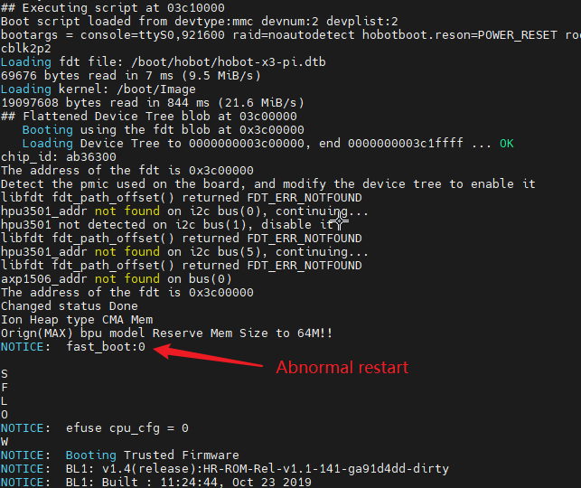
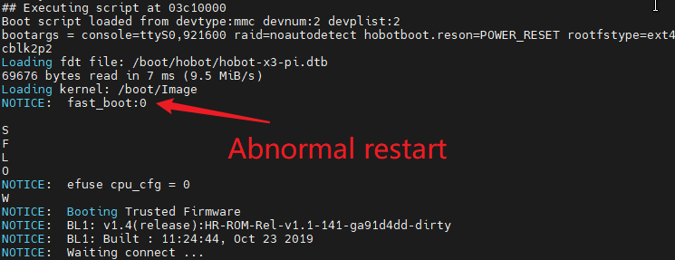
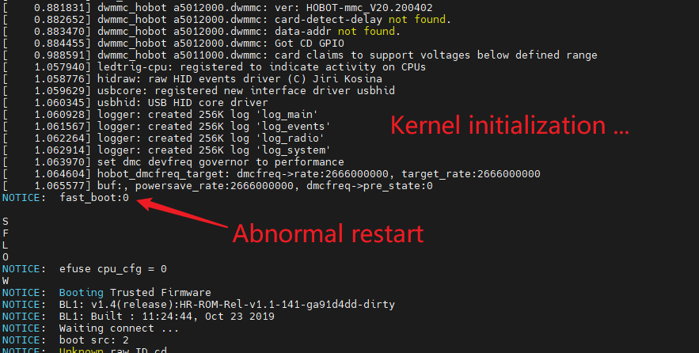

# 10.1 System Class

## No display after power on the development board

<font color='Blue'>[Issue]</font> 

- After power on the development board, the monitor continuously has no output, and connecting to the serial port indicates that the system is repeatedly rebooting or stuck at the uboot command line.

<font color='Green'>[Answer]</font> 

- Insufficient power supply causing repeated reboots, replace the 5V/3A adapter that meets the requirements of the development board, it is recommended to use the officially recommended adapter.
- Poor quality USB cable may cause power instability and abnormal power loss, resulting in repeated reboots.
- UART misoperation causing it to be stuck at the uboot, power cycle the device to recover.
- Micro SD card image format error, when the serial port prompts the following log, it needs to remake the image.


- Micro SD card quality issue, when the serial port prompts the following log, it means the Micro SD card is damaged and needs to be replaced.


## Common phenomena of abnormal power supply for development board

If the status LED of the development board does not turn off or blink continuously after power on, and no display is shown on the HDMI monitor, it is recommended to first check if the power supply is normal.

- Use a power adapter that supports **5V 3A** to power the development board, it is recommended to use the power adapter model recommended in the [Basic Accessories list](/hardware_development/rdk_x3/accessory#basic_accessories).
- If using your own charger, please choose a USB Type C cable from a reputable brand and ensure it meets the requirement of **5V 3A**.
- Do not directly power the development board from the USB port of a computer.

To determine whether the failure to start properly is caused by a power supply problem, we need to connect the development board to a serial port and observe the startup log. Currently, the following phenomena can clearly determine a power supply abnormality.

### Phenomenon 1: Restarting during Uboot kernel boot

At this time, it is in the Uboot stage, most of the tasks of Uboot have been completed, but when loading the kernel, device tree, etc. from the SD card to memory, or when jumping into the kernel for execution, the development board restarts abnormally.





### Phenomenon 2: Already running in the kernel, restarts after a few seconds

At this time, the kernel has been loaded and running, and the loading and initialization of the kernel and drivers are in progress, but the development board restarts abnormally.

### Other Phenomena:

The phenomenon of insufficient power supply can only be analyzed through serial port logs. If no **errors** or **warnings** are observed during the startup process in the log, and the development board directly prints `NOTICE: fast_boot: 0` and restarts, it can be basically determined that the issue is due to insufficient power supply.

Currently, the phenomena caused by insufficient power supply are easily confused with other phenomena such as SD card recognition failure or hardware damage. It is not easy to make a clear judgment without connecting to the serial port to view the logs. It is recommended to use the power adapter models recommended in the [basic accessory list](/hardware_development/rdk_x3/accessory#basic_accessories).

## Default Accounts of the Development Board

<font color='Blue'>【Question】</font>

- What types of accounts are supported by default on the development board?

<font color='Green'>【Answer】</font>

- The development board supports two types of accounts by default, as follows:
  - Default account: username `sunrise`, password `sunrise`
  - Root account: username `root`, password `root`

## Mounting NTFS File System
<font color='Blue'>【Question】</font>

- How to support read-write mode after mounting the NTFS file system?

<font color='Green'>【Answer】</font>

- After installing the ntfs-3g package, you can mount the NTFS file system to support write mode. The installation command is as follows:
    ```bash
    sudo apt -y install ntfs-3g
    ```

## Supported by vscode Tool
<font color='Blue'>【Question】</font>

- Does the development board support the `vscode` development tool?

<font color='Green'>【Answer】</font>

- The development board does not support local installation of `vscode`. Users can remotely connect to the development board through the `ssh-remote` plugin on the PC.

## adb Debugging Function
<font color='Blue'>【Question】</font>

- How to enable the adb debugging function on the development board?

<font color='Green'>【Answer】</font>

- The `adbd` service is enabled by default in Ubuntu system. Users only need to install the adb tool on the computer to use it. The method can refer to [bootloader image update](https://developer.horizon.ai/forumDetail/88859074455714818).

## apt update Update Fail<font color='Blue'>[Question]</font> 

- When running the `apt update` command in Ubuntu system, the following error is prompted:
    ```bash
    Reading package lists... Done
    E: Could not get lock /var/lib/apt/lists/lock. It is held by process 4299 (apt-get)
    N: Be aware that removing the lock file is not a solution and may break your system.
    E: Unable to lock directory /var/lib/apt/lists/
    ```

<font color='Green'>[Answer]</font> 

- The automatic update program in Ubuntu system conflicts with the operation `apt update` by the user. You can kill the automatic update process and try again, for example, `kill 4299`.

## File Transfer Methods for Development Boards

<font color='Blue'>[Question]</font> 

- What are the methods for file transfer between development boards and computers?

<font color='Green'>[Answer]</font> 

- File transfer can be done through network, USB, and other methods. For network transfer, you can use ftp tools, scp command, etc. For USB transfer, you can use USB flash drive, adb, etc. Taking scp command as an example, the file transfer methods are as follows:

    - Copy a single file `local_file` to the development board:

    ```bash
    scp local_file sunrise@192.168.1.10:/userdata/
    ```

    - Copy the entire directory `local_folder` to the development board:

    ```bash
    scp -r local_folder sunrise@192.168.1.10:/userdata/
    ```