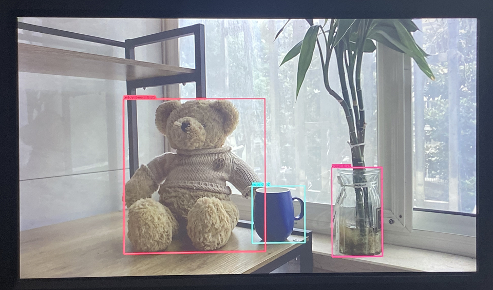

# 3.4 Using MIPI Camera

<iframe width="560" height="315" src="https://www.youtube.com/embed/nabpS2CUkjY?si=Hv1j0OYGoqj1eWjY" title="YouTube video player" frameborder="0" allow="accelerometer; autoplay; clipboard-write; encrypted-media; gyroscope; picture-in-picture; web-share" referrerpolicy="strict-origin-when-cross-origin" allowfullscreen></iframe>

The development board is installed with the "mipi_camera.py" program to test the data path of the MIPI camera. This example will capture the image data of the MIPI camera in real time, then run the object detection algorithm, and finally output the image data and detection results through the HDMI interface.

## Environment Preparation

  - Connect the MIPI camera module to the development board's MIPI CSI interface. For specific connection methods, please refer to the [MIPI Camera Connection Tutorial](../installation/hardware_interface#mipi_port) chapter.
  - Connect the development board to the monitor via an HDMI cable.

## Running the Program
Execute the program with the following command:

  ```bash
  sunrise@ubuntu:~$ cd /app/pydev_demo/03_mipi_camera_sample/
  sunrise@ubuntu:/app/pydev_demo/03_mipi_camera_sample$ sudo python3 ./mipi_camera.py 
  ```

## Expected Result
After the program is executed, the monitor will display the camera image and the results of the object detection algorithm (object type, confidence), as shown below:
 

:::tip

For detailed code implementation explanation, please refer to the [MIPI Camera Inference](/python_development/pydev_dnn_demo/mipi_camera) chapter.

:::