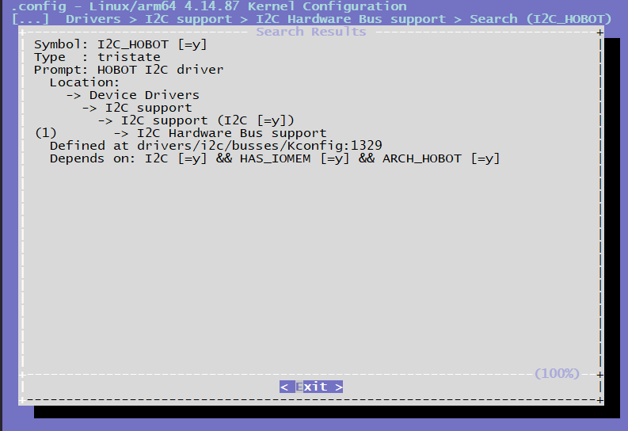

# I2C Debugging Guide

## Introduction

The X3 chip provides a standard I2C bus, where the I2C bus controller passes information between devices connected to the bus through the Serial Data Line (SDA) and Serial Clock Line (SCL). Each device has a unique address (whether it's a microcontroller, LCD controller, memory, or keyboard interface) and can function as both a transmitter and a receiver (depending on the device's functionality). The I2C controller supports the following features:

-   Compatibility with I2C and SMBus buses.

-   Frequency support for 100KHz and 400KHz.

-   Support for 7-bit and 10-bit addressing modes.

## Driver Code

```bash
drivers/i2c/busses/i2c-hobot.c # I2C driver code source file
include/linux/i2c-hobot.h # I2C driver code header file
```

### Kernel Configuration Location

CONFIG_I2C_HOBOT



### Kernel DTS Node Configuration

The X3 chip supports a maximum of 6 I2C buses, and the DTS configuration is as follows:

```c
/* arch/arm64/boot/dts/hobot/hobot-xj3.dtsi */
i2c0: i2c@0xA5009000 {
    compatible = "hobot,hobot-i2c";
    reg = <0 0xA5009000 0 0x100>;
    interrupt-parent = <&gic>;
    interrupts = <0 38 4>;
    clocks = <&i2c0_mclk>;
    clock-names = "i2c_mclk";
    bus-speed = <400000>;
    resets = <&rst 0x50 10>;
    reset-names = "i2c0";
    status = "disabled";
    pinctrl-names = "default";
    pinctrl-0 = <&i2c0_func>;
};
```Note: 
The nodes in hobot-xj3.dtsi mainly declare some registers and interrupts resources, which are common features of the soc and are not specific to a particular circuit board. In general, they do not need to be modified.

## I2C Usage

For the usage of I2C, detailed instructions can be found in Linux Kernel's Documentation/i2c directory. This document mainly lists the special parts of the X3J3 I2C driver interface.

### Kernel Space

The X3J3 I2C driver provides an interface in Kernel Space that allows setting the I2C transmission frequency. Here is an example of usage:

```c
#include <linux/i2c-hobot.h>
...
{
    struct client_request *client_data = (struct client_request *)(client->adapter->algo_data);
    ...
    client_data->client_req_freq = 100000; // Set the I2C transmission frequency to 100k
    ret = i2c_transfer(client->adapter, request, ARRAY_SIZE(request));
    ...
}
```

It is important to note that if the target transmission frequency is different from the default frequency, the target frequency needs to be set before each I2C transmission. This means that the frequency change only takes effect for a single transmission. This design ensures that changing the frequency and transmitting for a specific driver does not affect other drivers. The corresponding implementation can be found in i2c-hobot.c:

```bash
/* Check if the frequency needs to be changed, and set it according to the target frequency */
static void recal_clk_div(struct hobot_i2c_dev *dev)
{
        u32 clk_freq = 0;
        int temp_div = 0;
        struct client_request *client_req;

        client_req = (struct client_request *)dev->adapter.algo_data;
        clk_freq = clk_get_rate(dev->clk);
        if (client_req->client_req_freq != 0) {
                temp_div = DIV_ROUND_UP(clk_freq, client_req->client_req_freq) - 1;
        } else {
        temp_div = DIV_ROUND_UP(clk_freq, dev->default_trans_freq) - 1;
        }
        dev->clkdiv = DIV_ROUND_UP(temp_div, 8) - 1;
        if (dev->clkdiv > I2C_MAX_DIV) {
                dev_warn(dev->dev, "clkdiv too large, set to 255");
                dev->clkdiv = I2C_MAX_DIV;
        }
}

/* Reset I2C frequency to the default frequency */
```static void reset_client_freq(struct hobot_i2c_dev *dev)
{
        struct client_request *client_req;

        client_req = (struct client_request *)dev->adapter.algo_data;
        client_req->client_req_freq = 0;
}

/* I2C master_xfer function */
static int hobot_i2c_xfer(struct i2c_adapter *adap, struct i2c_msg msgs[], int num)
{
    ...
    recal_clk_div(dev);
    ... /* I2C transfer */
    reset_client_freq(dev);
    ...
}

### User Space

Typically, I2C devices are controlled by kernel drivers, but it is also possible to access all devices on the bus from user space using the /dev/i2c-%d interface. Detailed information can be found in the Documentation/i2c/dev-interface document in the kernel.

#### Frequency Setting

To check the frequency of I2C-N, taking i2c-0 as an example:

```bash
root@x3dvbx3-hynix1G-2666:~# cat /sys/bus/i2c/devices/i2c-0/speed
400000
```

To set the frequency of I2C-N, taking i2c-0 as an example:

```bash
root@x3dvbx3-hynix1G-2666:~# echo 100000 > /sys/bus/i2c/devices/i2c-0/speed
root@x3dvbx3-hynix1G-2666:~# cat /sys/bus/i2c/devices/i2c-0/speed
100000
```

Unlike setting the I2C frequency in kernel space, which only applies to a single transfer, setting the I2C frequency in user space is persistent. Use with caution!

#### I2c-tools

i2c-tools is a set of open-source tools that has been cross-compiled and included in the rootfs of the X3J3 system software. Customers can use it directly:

-   i2cdetect - used to list the I2C bus and all devices on the bus
-   i2cdump - display all register values of an i2c device
-   i2cget - read the value of a specific register of an i2c device
-   i2cset - write a value to a specific register of an i2c device- i2ctransfer - Can read and write the values of one or multiple registers of an i2c device.