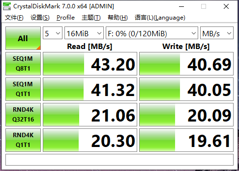

# USB Driver Performance Test

## Test Method

### On Development Board

1. Use `CrystalDiskMark` for testing (the software package is located in the `09-usb_test` directory).
2. Enter the following commands on the development board:
```bash
service adbd stop
cd /tmp
dd if=/dev/zero of=/tmp/700M.img bs=1M count=700
losetup -f /tmp/700M.img
losetup -a 
modprobe g_mass_storage file=/dev/loop0 removable=1
```

### On PC

1. The PC will prompt for the new disk device, format it as FAT32.
2. Open `CrystalDiskMark` on the PC, select the X3 device that was just mounted, click `All` to start the test. If there's a prompt for insufficient space, adjust the test file size accordingly.
3. After the test is finished, the first two items `SEQ1M*` represent the sequential read/write speed, and the following two items `RND4K*` represent the random read/write speed of 4k small files.
     


  **The speed shown in the image is for reference only**

## Test Standards

The test results are obtained from CrystalDiskMark SEQ1MQ8T1 read/write data  
USB 2.0: Read/write speed exceeds **40**MB/s  
USB 3.0: Read/write speed exceeds **370**MB/s