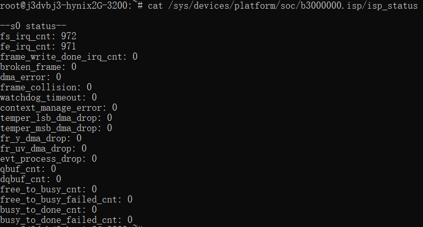
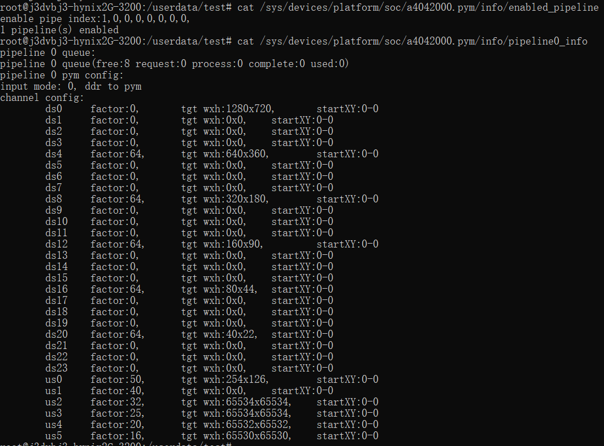
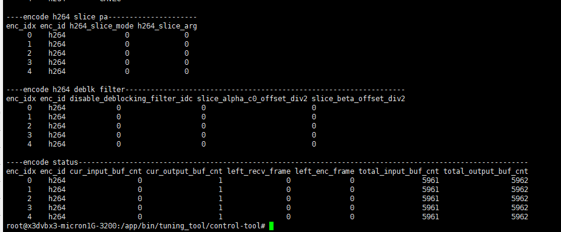

```markdown
# 7.11 Query Multimedia Module Debug Information

## Interaction between Driver and Multimedia System

In VIN, the control of the camera is done entirely in user space, while the control of mipi/ISP is done in the driver. By passing the user-space related configurations to the driver, the driver sets up the hardware. The relevant device nodes are as follows:


- **mipi_host0\~4:** mipi host configuration nodes, mainly for mipi\_host initialization.
- **mipi\_dphy:** dphy related node.
- **mipi_dev0:** This device node will be enabled in the configuration to enable mipi\_dev output.

- **SIF has two nodes:**
  - **sif_capture:** Set sif-related property information, initialize the sif module, and dump images from the sif module.
  - **sif_ddrin:** Set the properties/size/format of the ddrin node. Only used in sif-offline-isp scenario, responsible for reading memory data to isp.

- **ISP-related nodes:**
  - **ac\_calib:** Set calibration effect library.
  - **ac_isp:** Use isp effect adjustment interface.
  - **ac_isp4uf0\~7:** Use isp driver algorithm library to send commands.
  - **ac_sbuf0\~7:** Algorithm library synchronizes some algorithm data with isp driver through this device node.
  - **video0\~7:** isp v4l2 device node, set size/format/size, interact with the device through memory mapping.

In VIN, MIPI/SIF functions are relatively simple. For MIPI, it is actually several nodes abstracted from the hardware for user configuration parameters, so as to set the MIPI HOST to the corresponding state and be able to accept MIPI data input from the sensor.

SIF takes the data received by MIPI HOST and performs certain processing, such as saving different sensor data to different ddr addresses.

ISP's functions are relatively complex. It needs to interact with the sensor, load the corresponding algorithm library and effect library. In the configuration code:


- **ispAlgoState:** This tag indicates the use of 3A algorithm, which will use the algorithm in the lib_algo.so library.
- **calib:** This is the effect library configured for different sensors, used to adjust sensor effects.

## VIO Debug Information

### SIF Debug Information

View SIF debug information:
```
Please translate the parts in Chinese to English while keeping the original format and content:

```
cat /sys/devices/platform/soc/a4001000.sif/cfg_info
```


### ISP Debug Information

View ISP debug information:

```
cat /sys/devices/platform/soc/b3000000.isp/isp_status
```

>   

### IPU Debug Information

View enabled pipelines:

```bash
cat /sys/devices/platform/soc/a4040000.ipu/info/enabled_pipeline
```

View pipeline configurations:

```bash
cat /sys/devices/platform/soc/a4040000.ipu/info/pipelinex_info # x can be 0-7
# Example
cat /sys/devices/platform/soc/a4040000.ipu/info/pipeline0_info
```


Explanation:

subdev0 corresponds to ipu src, subdev1~6 correspond to ipu us/ds0~ds4. The information in parentheses after subdev represents the number of buffers in each state for that channel.

### PYM Debug Information

View enabled pipelines:

```
cat /sys/devices/platform/soc/a4042000.pym/info/enabled_pipeline
```Check the configuration of each pipe: 

```bash
cat /sys/devices/platform/soc/a4042000.pym/info/pipelinex_info # x takes values of 0-7
# Example
cat /sys/devices/platform/soc/a4042000.pym/info/pipeline0_info
```



### IAR Debug Information

View IAR debug information:

```
cat /sys/kernel/debug/iar
```


## VPU Debug Information

### VENC Debug Information

View encoding information:

```
cat /sys/kernel/debug/vpu/venc
```




### VDEC Debug Information

View decoding information:

```
cat /sys/kernel/debug/vpu/vdec
```


## JPU Debug Information

### JENC Debug Information

View encoding information:cat /sys/kernel/debug/jpu/jenc


### JDEC Debug Information

View decoding information:

```
cat /sys/kernel/debug/jpu/jdec
```


## Media Module Log Viewing

### Log Levels

Console output logs and logcat logs are mutually exclusive. They can be controlled by the environment variable LOGLEVEL.

For example, set export LOGLEVEL=14 to output all logs that are higher than or equal to the Debug level to the console.

If you want to view Debug and higher level logs through logcat, you need to set export LOGLEVEL=4.

| Console Output Log | | Logcat Log Level | |
| --------------------- | ---- | ------------------ | ---- |
| CONSOLE_DEBUG_LEVEL   | 14   | ALOG_DEBUG_LEVEL   | 4    |
| CONSOLE_INFO_LEVEL    | 13   | ALOG_INFO_LEVEL    | 3    |
| CONSOLE_WARNING_LEVEL | 12   | ALOG_WARNING_LEVEL | 2    |
| CONSOLE_ERROR_LEVEL   | 11   | ALOG_ERROR_LEVEL   | 1    |

### Log Tags

The media module defines several LOG_TAGs. The following are all available tags:

| vio-core vio-devop ipu sif dwe gdc pym vin isp rgn mipi vp vps venc vdec audio vot vio-bufmgr ffmedia multimedia |
|------------------------------------------------------------------------------------------------------------------|

Note:

Logs without tags cannot be filtered. They will be printed if they meet the LOG LEVEL requirements (usually seen in applications or modules without tags).

To add a tag to an application:

1. You can define \#define LOG_TAG "APP" at the beginning of the file.
2. Include the relevant header file \#include "logging.h".3. The logs in the application are printed using the macro definition of the pr_xxx switch in the logging.h header file.

### Log Filtering

The logs of each module can be filtered and viewed through logcat. Here is how to filter the logs related to modules. logcat is an open-source command, and other parameters can be explored independently.

For example, if you only want to print the logs of the vps module with a log level higher than Debug and output them to a file, you can do the following:

logcat vps:D -f log.txt

If you want to view the logs of multiple modules, you can append the filters at the end, such as viewing the logs of the vps/vin modules with a log level higher than Debug:

logcat vps:D vin:D -f log.txt

### Log Storage

Kernel logs will be saved in the /userdata/log/kernel/ directory.

When LOGLEVEL is set to 4, upper layer logs will be saved in the /userdata/log/usr/ directory.