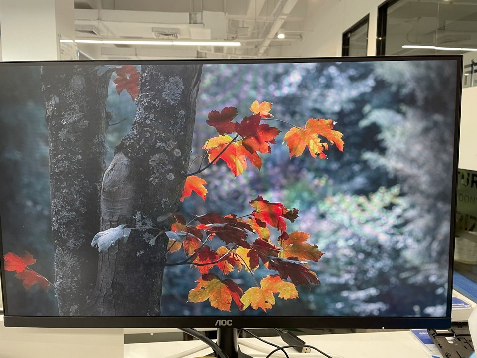
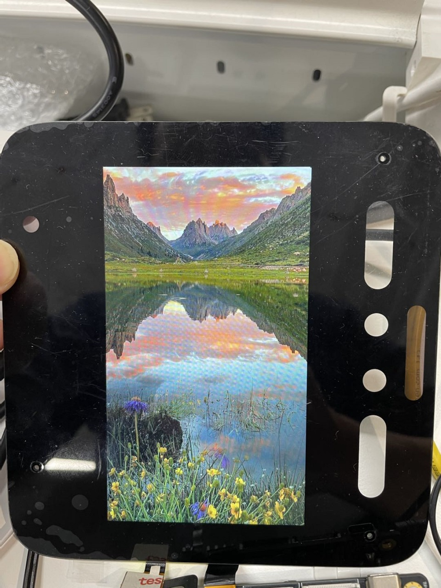
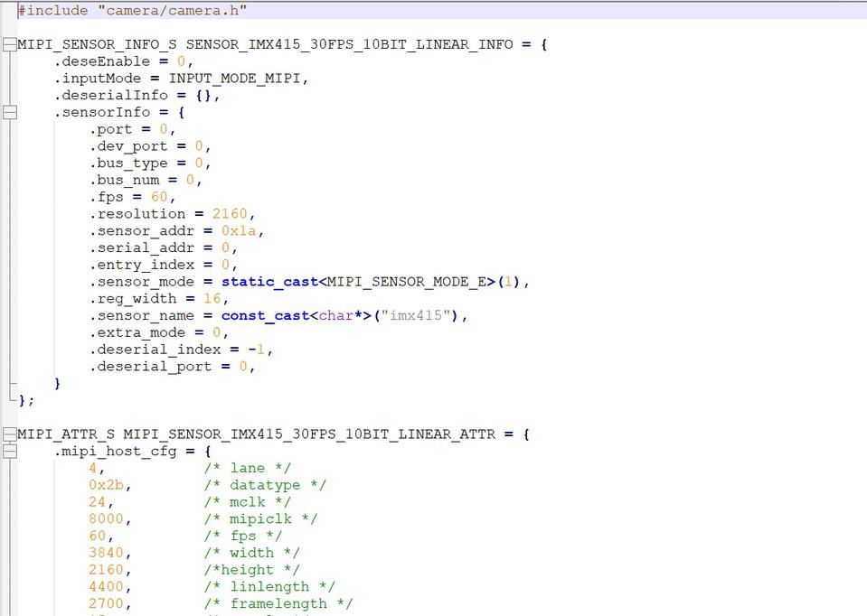
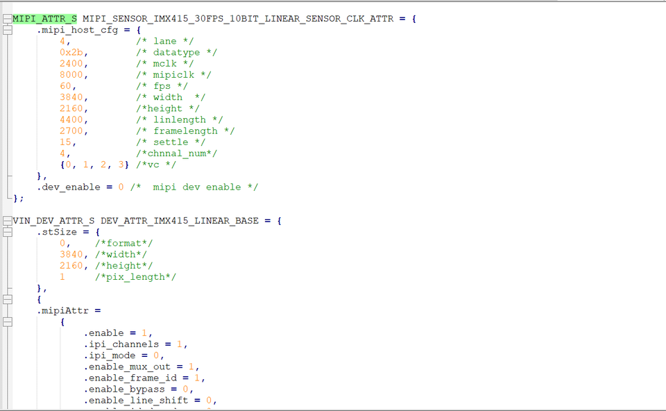
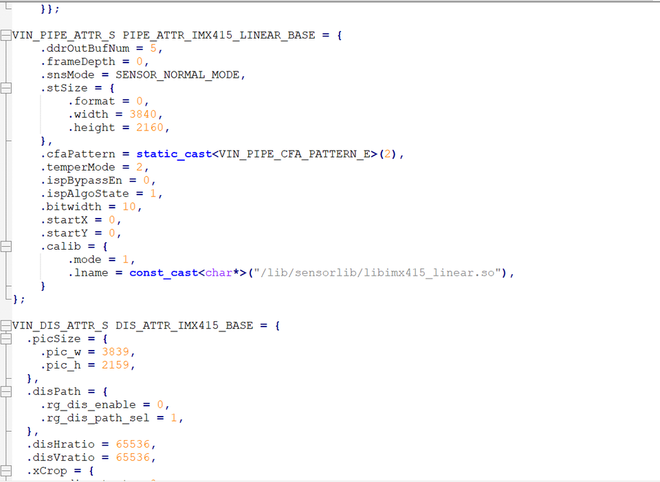
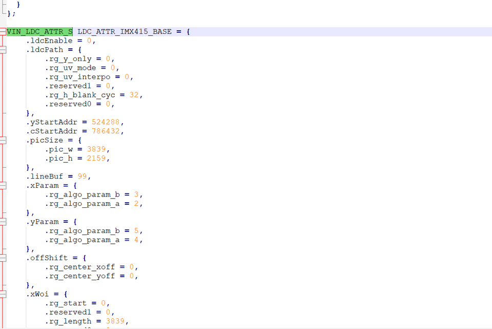
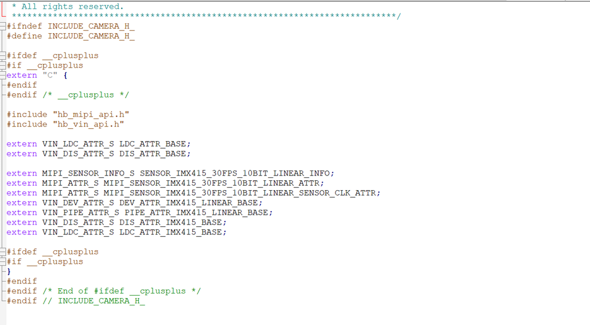

# 7.2 Sample Program
This chapter briefly describes the Horizon multimedia application examples. The source code involved can be obtained by running `sudo apt install hobot-multimedia-samples` and installed under the directory `/app/multimedia_samples`.
## Instructions for using get_sif_data{#get_sif_data}

### Program Function

The following diagram shows the video data path diagram of X3M, for explanations of the professional terms, please refer to [Overview of Multimedia Development - Terminology](./overview#terminology).


`get_sif_data` completes the initialization of the `sensor`, `MIPI CSI`, and `SIF` modules, and implements the function of acquiring video frame data from the `SIF` module, supporting obtaining images in both `Raw` and `YUV` formats from the `SIF` module.

`get_sif_data` can effectively assist users in debugging the lighting of the `sensor` and `X3M`. After establishing the data path from `sensor` to `SIF`, other module functions can be debugged.

### Program Development

#### Source Code Structure

The source code is located at `/app/multimedia_samples/get_sif_data`

```
.
├── main.c                       # Main program, loads the sensor list and controls the commands
├── Makefile			 # Makefile for compilation
├── module.c
├── module.h
├── Readme.md
├── sensor_handle.c              # Sensor initialization, interface for acquiring images from SIF
├── sensor_handle.h
├── sensors			 # Sensor parameter configuration, add a new file to this directory for each new sensor
│   ├── sensor_f37.c
│   └── sensor_imx415.c
└── sensors.lds
```

#### Compilation

The current code is compiled using a Makefile.

Enter the source code directory and execute the following command to compile and generate the `get_sif_data` program:

```bash
$ cd sample/get_sif_data
$ make clean # Clean the source code to maintain a clean code environment
$ make
```#### Adding a new sensor

If there is a new sensor that needs to be debugged, please refer to the source code files in the "sensors" directory and add a new sensor configuration accordingly.

Using F37 as an example to illustrate the key code:

```c
/*
 * Adding sensor, mipi, sif dev, isp parameter configurations
 * There are detailed comments in the code about the parameters in each struct
 * The isp parameters do not need to be concerned in this program
 */
static int set_sensor_param(void)
{
        printf("set_sensor_param\n");
        /* Define sensor's initialization attribute information */
        snsinfo = SENSOR_1LANE_F37_30FPS_10BIT_LINEAR_INFO;
        /* Define mipi's initialization attribute information */
        mipi_attr = MIPI_1LANE_SENSOR_F37_30FPS_10BIT_LINEAR_ATTR;
        /* Define dev's initialization attribute information */
        devinfo = DEV_ATTR_F37_LINEAR_BASE;
        /* Define pipe's attribute information */
        pipeinfo = PIPE_ATTR_F37_LINEAR_BASE;

        return sensor_sif_dev_init();
        return 0;
}

/*
 * The main program calls this function during the sensor module traversal to register the sensor name and sensor parameter configuration interface.
 */
static int sensor_probe(void)
{
        int i = 0;

        /* Find an empty position in sensor_lists */
        for (i = 0; i < ARRAY_SIZE(sensor_lists); i++) {
                if (0 == strlen(sensor_lists[i].sensor_tag)) break;
        }

        if (i >= ARRAY_SIZE(sensor_lists)) {
                printf("sensor lists is full\n");
                return -1;
        }
```

... ...· `q`：退出程序
· `g`：获取一帧图像并保存
· `l`：获取多帧图像并保存
· `h`：打印帮助信息- g: Get one frame of image, supports inputting multiple `g` to continuously acquire images, for example, input `gggg`.

```bash
Command: g
normal pipe_id (0)type(9)frame_id(4078)buf_index(5)w x h(1920x1080) data_type 9 img_format 0
stride_size(2400) w x h1920 x 1080  size 2592000
pipe(0)dump normal raw frame id(4078),plane(1)size(2592000)
filedump(pipe0_plane0_1920x1080_frame_4078.raw, size(2592000) is successed
time cost 67 ms 
dumpToFile raw cost time 67 ms
```

- l: Getting 12 frames of continuous images, equivalent to inputting 12 `g`s.

```bash
Command: l
normal pipe_id (0)type(9)frame_id(4588)buf_index(3)w x h(1920x1080) data_type 9 img_format 0
stride_size(2400) w x h1920 x 1080  size 2592000
pipe(0)dump normal raw frame id(4588),plane(1)size(2592000)
filedump(pipe0_plane0_1920x1080_frame_4588.raw, size(2592000) is successed
time cost 56 ms 
... ... # Continuous printout of frame data acquisition
dumpToFile raw cost time 56 msnormal pipe_id (0)type(9)frame_id(4609)buf_index(7)w x h(1920x1080) data_type 9 img_format 0
stride_size(2400) w x h1920 x 1080  size 2592000
pipe(0)dump normal raw frame id(4609),plane(1)size(2592000)
filedump(pipe0_plane0_1920x1080_frame_4609.raw, size(2592000) is successed
time cost 57 ms 
dumpToFile raw cost time 57 ms
```

- q: Quit the program.

```
Command: Command: q
quit
[  256.825912] [S0][V1]sif_video_streamoff
[  256.826439] SIF close node 1
[  256.853045] [S0][V0]sif_video_streamoff SIF last process stream off 
[  256.853922] [S0][V0]sif_video_streamoff
[  256.855476] hobot_dmcfreq_target: dmcfreq->rate:2666000000, target_rate:2666000000
[  256.856460] buf:performance
[  256.856460] , powersave_rate:2666000000, dmcfreq->pre_state:0
[  256.857610] [S0][V0]x3_sif_close SIF last process close 
[  256.858301] SIF close node 0
[  256.858807] [isp_drv]: camera_sys_stream_off: camera_sys_stream_off success line 1549 dev_name port_0
[  256.860006] [isp_drv:cam]: camera_fop_release: line 115 port 0 user_num 0  camera_cdev->start_num 0 
```#### 翻译结果
```
[  256.861229] vps mipi_host1: sensor1_mclk set(1) 0 as 24000000
[  256.861980] vps mipi_host1: sensor1_mclk set(0) 0 as 24000000
[  256.862741] vps mipi_host0: sensor0_mclk set(2) 0 as 24000000
[  256.863491] vps mipi_host0: sensor0_mclk set(1) 0 as 24000000
[  256.864241] vps mipi_host0: sensor0_mclk set(0) 0 as 24000000
```

#### Translation
```
[  256.861229] vps mipi_host1: sensor1_mclk set(1) 0 as 24000000
[  256.861980] vps mipi_host1: sensor1_mclk set(0) 0 as 24000000
[  256.862741] vps mipi_host0: sensor0_mclk set(2) 0 as 24000000
[  256.863491] vps mipi_host0: sensor0_mclk set(1) 0 as 24000000
[  256.864241] vps mipi_host0: sensor0_mclk set(0) 0 as 24000000
```├── sensor_handle.c              # sensor initialization, interface for obtaining image from isp
├── sensor_handle.h
├── sensors                       # sensor parameter configuration, add a new file for each new sensor in this directory
│   ├── sensor_f37.c
│   └── sensor_imx415.c
└── sensors.lds

#### Compilation

The current code is compiled through a Makefile. To compile and generate the `get_isp_data` program, enter the source code directory and execute the following commands:

```bash
$ cd /app/multimedia_samples/get_sif_data
$ make clean # Clean the source code to maintain a clean code environment
$ make
... ... # A long series of compilation prints
$ ls
get_isp_data  main.c  main.o  Makefile  module.c  module.h  module.o  Readme.md  sensor_handle.c  sensor_handle.h  sensor_handle.o  sensors  sensors.lds
```

#### Adding a new sensor

If there is a new sensor that needs to be debugged, please refer to the source code files in the "sensors" directory and add a new sensor configuration accordingly.

Take F37 as an example to explain the key code:

```c
/* 
 * Add sensor, mipi, sif dev, and isp parameter configuration
 * The structure parameters have detailed comments in the code
 */
static int set_sensor_param(void)
{
        printf("set_sensor_param\n");
        /* Define sensor initialization attributes */
        snsinfo = SENSOR_1LANE_F37_30FPS_10BIT_LINEAR_INFO;
        /* Define mipi initialization parameters */
        mipi_attr = MIPI_1LANE_SENSOR_F37_30FPS_10BIT_LINEAR_ATTR;
        /* Define dev initialization attributes */
        devinfo = DEV_ATTR_F37_LINEAR_BASE;
        /* Define pipe attributes */
        pipeinfo = PIPE_ATTR_F37_LINEAR_BASE;
    	/* Define dis attributes */
    	disinfo = DIS_ATTR_F37_BASE;
    	/* Define ldc attributes */
    	ldcinfo = LDC_ATTR_F37_BASE;
        return sensor_sif_dev_init();
        return 0;
}
```/* 
 * This function is called by the main program to register the sensor name and sensor parameter configuration interface when traversing the sensor module.
 */
static int sensor_probe(void)
{
        int i = 0;

        /* Find an empty position in sensor_lists */
        for (i = 0; i < ARRAY_SIZE(sensor_lists); i++) {
                if (0 == strlen(sensor_lists[i].sensor_tag)) break;
        }

        if (i >= ARRAY_SIZE(sensor_lists)) {
                printf("sensor lists is full\n");
                return -1;
        }

        strncpy(sensor_lists[i].sensor_tag, SENSOR_TAG, 31 > strlen(SENSOR_TAG) ? strlen(SENSOR_TAG) : 31);
        sensor_lists[i].func = set_sensor_param;
        return 0;
}

/* Register the entry point of the sensor module, which will be used by the main program when traversing the sensor */
SENSOR_MODULE_INSTALL(sensor_probe);
```


### Function Usage

#### Hardware Connection

The RDK X3 development board is connected to the Sensor module through the `mipi host` interface. Please connect it correctly according to the current sensor module model being debugged.

#### Program Deployment

After generating `get_isp_data` according to the above compilation process, execute the program and select the current sensor category that is connected to the development board correctly according to the prompt. For example, if the currently connected sensor is the `F37 sensor`, select 1.

If the initialization is successful, the first frame image (`pipe0_1920x1080_frame_001.yuv`) will be automatically saved in the directory where the program runs (you can check it by executing `ls -l pipe0_1920x1080_frame_*` after exiting the program), and the commands that the user can use will be printed. The running process is as follows:

```bash
chmod +x get_isp_data
./get_isp_data

Horizon Robotics Sensor Test Tools V1.0

********************** Sensor Lists *************************
        0 -- IMX415
        1 -- F37
*************************************************************
```Please select: 1 # Select sensor
... ... # A long string of initialization logs
normal pipe_id (0)type(11)frame_id(1)buf_index(0)w x h(1920x1080) data_type 11 img_format 0
stride_size(2400) w x h1920 x 1080 size 2073600
pipe(0)dump normal yuv frame id(1),plane(1)size(2073600) # Get the first frame image
filedump(pipe0_1920x1080_frame_001.yuv, size(2073600) is successed
time cost 63 ms 
dumpToFile yuv cost time 63 ms********************** Command Lists *************************
  q     -- quit
  g     -- get one frame
  l     -- get a set frames
  h     -- print help message

Command: 

**Command explanation:**

- g: Get one frame image, supports inputting multiple 'g' to continuously get images, for example, input 'gggg'

```bash
Command: g
normal pipe_id (0)type(11)frame_id(4078)buf_index(5)w x h(1920x1080) data_type 11 img_format 0
stride_size(2400) w x h1920 x 1080 size 2073600
pipe(0)dump normal yuv frame id(4078),plane(1)size(2073600)
filedump(pipe0_1920x1080_frame_4078.yuv, size(2073600) is successed
time cost 63 ms 
dumpToFile yuv cost time 63 ms
```

- l: Get 12 frames continuously, equivalent to inputting 12 'g'

```bash
Command: l
normal pipe_id (0)type(11)frame_id(4588)buf_index(3)w x h(1920x1080) data_type 11 img_format 0
stride_size(2400) w x h1920 x 1080 size 2073600
pipe(0)dump normal yuv frame id(4588),plane(1)size(2073600)
filedump(pipe0_1920x1080_frame_4588.yuv, size(2073600) is successed
time cost 56 ms 
... ... # Continuously printing frame data
dumpToFile yuv cost time 56 msnormal pipe_id (0)type(11)frame_id(4609)buf_index(7)w x h(1920x1080) data_type 11 img_format 0
stride_size(2400) w x h1920 x 1080 size 2073600
pipe(0)dump normal yuv frame id(4609),plane(1)size(2073600)
filedump(pipe0_1920x1080_frame_4609.yuv, size(2073600) is successed
time cost 57 ms 
dumpToFile yuv cost time 57 ms
```- q: Quit the program

```
Command: Command: q
quit
[  256.825912] [S0][V1]sif_video_streamoff
[  256.826439] SIF close node 1
[  256.853045] [S0][V0]sif_video_streamoff SIF last process stream off 
[  256.853922] [S0][V0]sif_video_streamoff
[  256.855476] hobot_dmcfreq_target: dmcfreq->rate:2666000000, target_rate:2666000000
[  256.856460] buf:performance
[  256.856460] , powersave_rate:2666000000, dmcfreq->pre_state:0
[  256.857610] [S0][V0]x3_sif_close SIF last process close 
[  256.858301] SIF close node 0
[  256.858807] [isp_drv]: camera_sys_stream_off: camera_sys_stream_off success line 1549 dev_name port_0
[  256.860006] [isp_drv:cam]: camera_fop_release: line 115 port 0 user_num 0  camera_cdev->start_num 0 
[  256.861229] vps mipi_host1: sensor1_mclk set(1) 0 as 24000000
[  256.861980] vps mipi_host1: sensor1_mclk set(0) 0 as 24000000
[  256.862741] vps mipi_host0: sensor0_mclk set(2) 0 as 24000000
[  256.863491] vps mipi_host0: sensor0_mclk set(1) 0 as 24000000
[  256.864241] vps mipi_host0: sensor0_mclk set(0) 0 as 24000000
```

#### Explanation of Running Effect

After running the program, you will obtain a `yuv` image named `pipe0_1920x1080_frame_4609.yuv`.

Please use the [hobotplayer](http://sunrise.horizon.cc/downloads/hobotplayer/hobotplayerv.2.07.1.rar) tool to view the image. The configuration of the image is as follows:

- View the YUV image

Configure the options as shown below, paying attention to the configuration of `pic_type`, `yuv_type`, `width`, and `height` in the `file config`. F37 configuration is (PIC_YUV, YUV_NV12, 1920, 1080), IMX415 configuration is (YUV_NV12, 3840, 2160).


## Sample_isp User Manual

### Program Function

The `sample_isp` program initializes the `isp` image interface. Its main function is to dynamically set/get parameters for each `isp` image and return the test result.

### Program Development

#### Source Code Structure

The source code is located at `/app/multimedia_samples/sample_isp`.

```
.```
├── main.c			# Main program
├── Makefile			# Compilation makefile
└── Readme.md			# Program instructions
```

#### Compilation

The current code is compiled through a Makefile.

Enter the source code directory and execute the following command to compile and generate `sample_isp`:
```
$ cd /app/multimedia_samples/sample_isp
$ make clean # Clean the source code to maintain a clean code environment
$ make
... ... # A lot of compilation prints
$ ls
main.c  main.o  Makefile  sample_isp
```

### Function Usage

#### Program Deployment

After generating `sample_isp` according to the above compile process, run the program.

Note that the sensor program needs to be running before running this program. The sensor program can be run directly using `Sunrise_camera`. The process of running `sample_isp` is as follows:

```bash
chmod +x sample_isp
# ./sample_isp
============================================
APP: ./sample_isp
a: AE
b: AF
c: AWB
d: BL
e: DEMOSAIC
f: SHARPEN
g: GAMMA
h: IRIDIX
i: CNR
j: SINTER
k: TEMPER
l: SCENE_MODES
m: FIRMWARE STATE
n: MODULE CONTROL
o: REGISTER
p: LIBREG_AE
q: LIBREG_AWB
```r: LIBREG_AF
s: METERING AE(read only)
t: METERING AWB(read only)
u: METERING AF(read only)
v: METERING AE_5BIN(read only)
w: METERING_DATA_TIME(read only)
x: SWITCH SCENE
A: CSC
B: MESH SHADING
C: MESH SHADING LUT
D: RADIAL SHADING
E: RADIAL SHADING LUT
F: IRIDIX STRENGTH LEVEL
G: IDX_IRQ_SYNC
H: IDX_AWB_ZONE
I: IDX_AF_ZONE
L: IDX_AF_KERNEL
M: IDX_AEROI_INFO
N: IDX_LUMA_INFO
O: IDX_AEPARAM_INFO
J: IDX_AE5BIN_ZONE
K: IDX_AE_ZONE
P: IDX_AE_EX
y: Help
Q: Exit
============================================
ISP_TEST>
```
#### Command Explanation:

- a: Get/Set AE properties

- b: Not supported in the example

- c: Get/Set AWB properties

- d: Get/Set BlackLevel properties

- e: Get/Set Demosaic properties

- f: Get/Set SHARPEN properties

- g: Get/Set GAMMA properties

- h: Get/Set IRIDIX properties

- i: Get/Set CNR properties

- j: Get/Set SINTER properties- k: Get/Set TEMPER attribute
- l: Get/Set SCENE_MODES attribute
- m: Get/Set FWSTATE attribute
- n: Get/Set ModuleControl attribute
- o: Get/Set Register register
- p: Register AE callback interface
- q: Register AWB callback interface
- r: Register AF callback interface
- s: Get AE statistics information
- t: Get AWB statistics information
- u: Get AF statistics information
- v: Get AE_5BIN statistics information
- w: Get the latest statistics information (by default, the code gets AWB, can be changed to AE or AF statistics information by passing parameters)
- x: Switch ISP effect library (the so library needs to be in the same directory as the isp_test file)
- A: Get/Set CSC attribute
- B: Get/Set MESH_SHADING attribute
- C: Get/Set MESH SHADING LUT attribute
- D: Get/Set RADIAL SHADING attribute
- E: Get/Set RADIAL SHADING LUT attribute
- F: Get/Set IRIDIX STRENGTH LEVEL attribute
- G: Get frame synchronization start/end time
- H: Set AWB_ZONE attribute
- I: Set AF_ZONE attribute
- L: Get/Set AF_KERNEL_INFO attribute
- M: Get/Set AEROI information- N: Get LUMA information
- O: Get/set AEParam information
- J: Set AE5BIN_ZONE attribute
- K: Set AEZONE attribute
- P: Get/set additional AE properties
- y: Help information
- Q: Exit program

## sample_vps Instructions{#sample_vps}

### Program Functionality

The `sample_vps` program uses multiple channels of a `vps grp` to perform operations such as cropping, rotation, scaling, etc. on YUV images, demonstrating the basic usage of `vps`. For more advanced image processing using `vps`, please refer to the [Video Processing](./video_processing) chapter.

### Program Development

#### Source Code Structure

The source code is located at: `/app/multimedia_samples/sample_vps`

```
.
|-- 19201080.yuv      # Source file in NV12 format for playback
|-- main.c            # Main program
`-- Makefile          # Compilation makefile
```

#### Compilation

The current code is compiled using a Makefile.

To compile and generate the `sample_vps`, enter the source code directory and execute the following commands:

```shell
$ cd /app/multimedia_samples/sample_vps
$ make clean # Clean the source code to maintain a clean code environment
$ make
... ... # A long printout of the compilation process
$ ls
19201080.yuv  main.c  main.o  Makefile  sample_vps
```

### Functionality Usage#### Program Deployment

Generate `sample_vps` according to the above compilation process, and make sure that `19201080.yuv` exists in the current directory. Then execute the program `./sample_vps`.

#### Description of Running Effects
The `YUV` image is processed using `vps` for cropping, rotation, scaling, and other functions, and the corresponding processed `YUV` images are saved.
* `grp_0_chn_1_out_1280_720.yuv` is the original image cropped to a resolution of `1280x720`;
* `grp_0_chn_2_out_1088_1920.yuv` is the image rotated 90 degrees from the original image;
* `grp_0_chn_3_out_960_540.yuv` is the original image resized to a resolution of `960x540`;
* `grp_0_chn_5_out_2880_1620.yuv` is the original image enlarged to a resolution of `2880x1620`;

## sample_vps_zoom Instructions {#sample_vps_zoom}

### Program Function

The `sample_vps_zoom` program uses the `ipu` and `pym` hardware modules of `vps` to zoom in on multiple areas of the `YUV` image, encode the processed `YUV` image into an `H264` video stream, and preview it directly using tools such as `MPC-BE`. It is similar to the `zoom` function in an electronic gimbal. The entire program's `Pipeline` is shown in the following figure:


As shown in the `Pipeline`, the program reads the `YUV` image through `vps0`, binds `vps0 chn1` and `vps1`, processes it through `crop` and enlargement using `ipu` and `pym`, and sends the data to `venc chn1` for `H264` encoding to achieve the `zoom` effect. At the same time, `vps0 chn2` is bound to `venc chn0` for `H264` encoding, and `vps0 chn3` is bound to `venc chn2` for `H264` encoding.

### Program Development

#### Source Code Structure

The source code is located at: `/app/multimedia_samples/sample_vps_zoom`

```
.
|-- 19201080.yuv      # The NV12 format file used for feedback
|-- main.c            # Main program
`-- Makefile          # Compilation Makefile
```

#### Compilation

The current code is compiled and built through a Makefile configuration.

Go to the source code directory and execute the following command to compile and generate the `sample_vps_zoom` program:

```shell
$ cd /app/multimedia_samples/sample_vps_zoom
$ make clean # Clean the source code to keep a clean code environment
$ make
... ... # A long segment of compilation printing
$ ls
19201080.yuv  main.c  main.o  Makefile  sample_vps_zoom
```

### Function Usage#### Program Deployment

Generate `sample_vps_zoom` according to the above compilation process, making sure that the `19201080.yuv` file exists in the current directory.

Execute the program `./sample_vps_zoom`.

#### Running Effects Description

The `YUV` image is encoded into a smooth zoom `H264` stream by using the backfill method and the `ipu`, `pym`, `venc` modules. The effect is shown below.


## sample_osd Instructions{#sample_osd}

### Program Function

The `sample_osd` program is used to overlay timestamps and Chinese text `osd` on the `YUV` data output from the `vps` channel. For more advanced `osd` image processing, please refer to the [Region Processing](./region_processing) section.

### Program Development

#### Source Code Structure

The source code is located at: `/app/multimedia_samples/sample_osd`

```
.
|-- 1280720.yuv       # Backfill using NV12 format file
|-- main.c            # Main program
|-- Makefile          # Compilation makefile
```

#### Compilation

The current code is compiled through a Makefile file configuration.

Enter the source code directory and execute the following command to compile and generate the `sample_osd` program.

```shell
$ cd sample/sample_osd
$ make clean # Clean the source code to maintain a clean code environment
$ make
... ... # A long compilation log
$ ls
1280720.yuv  main.c  main.o  Makefile  sample_osd
```
### Function Usage

#### Program DeploymentAfter generating `sample_osd` according to the above compilation process, make sure that `1280720.yuv` exists in the current directory, and then execute `sample_osd`.

#v## Running Effect Description

The `YUV` image output by the `vps` channel after overlaying `osd` is shown in the following figure:


## Usage of sample video codec{#sample_video_codec}

### Program Functions

- `sample_vdec_basic` implements the basic decoding function, reads local `H264`/`H265`/`MJPEG` files, decodes and saves the `NV12` result.

- `sample_venc_basic` implements the basic encoding function, reads `NV12` images, encodes them into `H264` (or `H265` or `MJPEG`), and saves them as local files.

- `sample_vdec_two_channel` is targeted at scenes that require decoding multiple channels at the same time. It adds a decoding channel on the basis of `sample_vdec_basic` to achieve dual-channel decoding. It reads local `H264`/`H265`/`MJPEG` files and decodes them concurrently, saving them as `NV12` files separately.

- `sample_venc_two_channel` is targeted at scenes that require encoding multiple channels at the same time. It adds an encoding channel on the basis of `sample_venc_basic` to achieve dual-channel encoding. It reads local `NV12` files and encodes them concurrently, saving them as `H264` (or `H265` or `MJPEG`).

### Program Development

#### Source Code Structure

The source code is located at: `/app/multimedia_samples/sample_video_codec`

```
.
├── example_vdec_basic
├── example_vdec_two_channel
├── example_venc_basic
├── example_venc_two_channel
├── Makefile
├── README.md
├── sample_vdec_basic.c
├── sample_vdec_two_channel.c
├── sample_venc_basic.c
└── sample_venc_two_channel.c
```

#### Compilation

The current code is configured to compile through a Makefile.

Enter the source code directory and execute the following command to compile and generate `sample_venc_basic`, `sample_vdec_basic`, `sample_vdec_two_channel`, and `sample_venc_two_channel` programs.

```shell
$ cd /app/multimedia_samples/sample_video_codec
$ make clean # Clean the source code to maintain a clean code environment
$ make... ... # A long compilation printout
$ ls
example_vdec_basic        example_venc_basic        Makefile   sample_vdec_basic    sample_vdec_two_channel    sample_venc_basic    sample_venc_two_channel
example_vdec_two_channel  example_venc_two_channel  README.md  sample_vdec_basic.c  sample_vdec_two_channel.c  sample_venc_basic.c  sample_venc_two_channel.c
```

### Program Deployment

#### sample_vdec_basic

After generating the `sample_vdec_basic` program using the compilation process described above,

execute `./sample_vdec_basic -w width -h height -t ecode_type -f file`

where width represents the number of pixels in the image's width,

height represents the pixel format in the image's height,

encode_type can be h264\h265\mjpeg,

and file is the name of the file to be decoded.

#### sample_venc_basic

After generating the `sample_venc_basic` program using the compilation process described above,

execute `./sample_venc_basic -w width -h height -t ecode_type -f file0 -g file1`

where width represents the number of pixels in the image's width,

height represents the pixel format in the image's height,

ecode_type can be h264\h265\mjpeg,

file0 is the name of the file to be encoded and it needs to be in NV12 format,

file1 is the name of the file to be encoded and it needs to be in NV12 format. Its width and height should be the same as file0.

#### sample_vdec_two_channel

After generating the `sample_vdec_two_channel` program using the compilation process described above,

execute `./sample_vdec_two_channel -w width -h height -t ecode_type -f file`

where width represents the number of pixels in the image's width,

height represents the pixel format in the image's height,

ecode_type can be h264\h265\mjpeg.#### sample_venc_two_channel

After generating the `sample_venc_two_channel` program according to the compilation process above,

Execute `./sample_venc_two_channel -w width -h height -t ecode_type -f file0 -g file1`

Where `width` is the number of pixels in the image width,

`height` is the pixel format contained in the image height,

`ecode_type` can be h264\h265\mjpeg,

`file0` is the file name to be encoded and needs to be in NV12 format,

`file1` is the file name to be encoded and needs to be in NV12 format, and its `width` and `height` need to be the same as `file0`.

### Running Effect Description

#### sample_vdec_basic

Generates `decode.nv12` in the current running directory, the content of this file is updated with the decoding content.

#### sample_venc_basic

Generates `sample_venc.h264/sample_venc.h265/sample_venc.jpg` in the current running directory. The H264/H265 files show alternative display of `file1` and `file2`.

#### sample_vdec_two_channel

Generates `sample_decode_ch0.nv12` and `sample_decode_ch1.nv12` in the current running directory, the content of these files is updated with the decoding content.

#### sample_venc_two_channel

Generates `sample_venc_ch0.h264(sample_venc_ch0.h265/sample_venc_ch0.jpg)` and `sample_venc_ch1.h264(sample_venc_ch1.h265/sample_venc_ch1.jpg)` in the current running directory. The H264/H265 files show alternative display of `file1` and `file2`.

## sample_vot Usage Instructions{#sample_vot}

### Program Function

The `sample_vot program` initializes the `VOT` module and implements the function of reading an nv12 image data frame from the current directory and sending it to the `VOT` bt1120 output display.

### Program Development

#### Source Code Structure

The source code is located in:`/app/multimedia_samples/sample_vot`

```
.```

├── 1280_720yuv8.yuv                      # Playback using 720P NV12 format file
├── 1920_1080yuv8.yuv                     # Playback using 1080P NV12 format file
├── Makefile                               # Compile makefile
├── Readme.md                              # Program instructions
└── vot.c                                  # Main program

```

### Compilation

The current code is compiled through a Makefile.

Enter the source code directory and execute the following command to compile and generate `sample_vot`.

```shell
cd /app/multimedia_samples/sample_vot
$ make clean # Clean the source code to maintain a clean code environment
$ make
... ... # A large block of compilation prints
$ ls
1280_720yuv8.yuv  1920_1080yuv8.yuv  Makefile  Readme.md  sample_vot  vot.c  vot.o
```


### Function Usage

#### Program Deployment

Compile the code according to the above compilation process to generate `sample_vot`

Execute the program `./sample_vot 1080P30`.

```bash
chmod +x sample_vot
root@x3sdbx3-samsung2G-3200:/userdata# ./sample_vot 1080P60
[   26.051955] channel id is 0, enable is 0, reg value is 0x4ef00f.
[   26.052744] channel id is 1, enable is 0, reg value is 0x4ef00f.
[   26.053520] channel id is 2, enable is 0, reg value is 0x4ef00f.
[   26.054339] channel id is 3, enable is 0, reg value is 0x4ef00f.
stLayer width:1920[   26.055263] channel id is 0, enable is 1, reg value is 0x14ef00f.
stLayer height:1080
libiar: hb_disp_set_timing done!
stChnAttr priority :2
stChnAttr src width :1920
stChnAttr src height :1080
stChnAttr s32X :0
stChnAttr s32Y :0
stChnAttr u32DstWidth :1920
stChnAttr u32DstHeight :1080
[   26.056165] iar_output_stream.
stCrop width :1920
```stCrop height :1080
[   26.059304] channel id is 0, enable is 1, reg value is 0x14ef00f.
framesize:3110400

(Note: If using X3 SDB board, the supported parameters are only 1080P60/1080P30. If using the sil902x's bt1120 to hdmi chip, the parameters can be as follows:
	1080P60
	1080P59.94
	1080P50
	1080P30
	1080P29.97
	1080P25
	1080I60
	1080I59.94
	1080I50
	720P60
	720P59.94
	720P50
	720P29.97)

#### Running Effect Description

The program reads the `1920_1080yuv8.yuv` file into memory and sends the data to the `bt1120` interface of the `VOT` module through the interface, and then outputs the `hdmi` effect to the display device through the `hdmi` conversion chip as shown in the following figure.



## sample_lcd Usage Instructions{#sample_lcd}

### Program Function

The `sample_lcd program` initializes the `VOT` module and reads one frame of NV12 picture data from the current directory and sends it to `VOT`'s `midi-dsi` output to display on the lcd screen.

### Program Development

#### Source Code Structure

The source code is located at: `/app/multimedia_samples/sample_lcd`

```
.
├── 720x1280.yuv	# NV12 format file for playback
├── Makefile		# Compilation makefile
├── Readme.md		# Program instructions
└── vot.c			# Main program
```

#### CompilationThe current code is compiled and configured through a Makefile file.

Go to the source code directory and execute the following commands to compile and generate the `sample_lcd` program:

```shell
$ cd /app/multimedia_samples/sample_lcd
$ make clean # Clean the source code to maintain a clean code environment
$ make
... ... # A long compilation output
$ ls
720x1280.yuv  vot.c  vot.o  Makefile  sample_lcd
```
### Function Usage

#### Program Deployment

Follow the above compilation process to generate the `sample_lcd` program and ensure that the `720x1280.yuv` file exists in the current directory.

Run the program `./sample_lcd`.

```bash
chmod +x sample_lcd
# ./sample_lcd
root@x3sdbx3-samsung2G-3200:/userdata# ./sample_lcd 
libiar: hb_disp_set_timing done!
HB_VOT_SetChnAttr 0: 0
HB_VOT_EnableChn: 0
HB_VOT_EnableChn: 0
framesize:1382400
```

#### Running Effect Explanation

The program reads the `720x1280.yuv` file into memory and sends the data to the `VOT` module's `midi-dsi` interface through an interface, and then displays it on the `lcd` screen device as shown in the following image.



## Usage Instructions for `sample_usb_cam_4k60` {#sample_usb_cam_4k60}

### Program Function

The `sample_usb_cam_4k60` program initializes the `sensor`, `MIPI CSI`, `SIF`, `ISP`, `VENC`, and `USB` modules, achieves real-time data acquisition from the sensor, and encodes the output through the encoder. It transfers the video to the PC for preview through the USB module.

The software architecture diagram is as follows:


### Function Usage

#### Program DeploymentCopy the directory `sample/sample_usb_cam_4k60/out` to the `/userdata` directory on the board using tools like WinSCP. Then, enter the `/userdata/out` directory on the board and execute the `sh run_usb_cam_imx415.sh` script to run the program. The execution result is as follows:

```bash
root@x3sdbx3-samsung2G-3200:/userdata/out# cd /userdata/
root@x3sdbx3-samsung2G-3200:/userdata/out# sh run_usb_cam_imx415.sh 
run_usb_cam_imx415.sh: line 17: can't create /sys/bus/platform/drivers/ddr_monitor/read_qos_ctrl/all: Permission denied
run_usb_cam_imx415.sh: line 18: can't create /sys/bus/platform/drivers/ddr_monitor/write_qos_ctrl/all: Permission denied
>>>>>>>>>>>>> g1 is exist. delete it!
Detecting platform:
 board : Hobot XJ3 SOC SDB
 udc   : b2000000.dwc3
Stopping the USB gadget
usb-gadget is not running
Detecting platform:
 board : Hobot XJ3 SOC SDB
 udc   : b2000000.dwc3
show user config:
USB_VID: 0x1d6b
USB_PID: 0x0102
SERIAL: 0x6856e824
MANUF: hobot
PRODUCT: xj3
USE_UVC: true
USE_HID: false
USE_UAC1: false
USE_UAC2: false
USE_ADB: false
USE_MSD: false
USE_ACM: false
USE_RNDIS: false
USE_ECM: false
Creating the USB gadget
Loading composite module
Creating gadget directory g_comp
OK
init configfs...
Setting Vendor and Product ID's
OK
single function gadget
Setting English strings
OK
Creating Config
Init functions...
funciton_init, but do nothing, please init on demand
OK
Bind functions...
Bind functions according to .usb-config file
bind uvc...
Creating UVC gadget functionality : uvc.0
```sh: 0: unknown operand
OK
Pre run userspace daemons(eg. adb)...
0
0
waiting
.
OK
Binding USB Device Controller
OK
Run some userspace daemons(eg. usb_camera)...
usb-gadget start succeed.
Open config file ./config/vin_vps_config_usb_cam.json success
Open config file1 ./config/vin_vps_config_usb_cam.json
Can not find key: tailWeight
Can not find key: manualTimeCount
Can not find key: autoTimeCount
Can not find key: manualAeM1
imx415_init_3840x2160_60_fps_linear_setting OK!
hb_vps_init grp_attr.maxW = 3840, grp_attr.maxH = 2160
chn_attr.width = 3840,chn_attr.height = 2160
set ipu chn Attr ok: GrpId = 0, chn_id = 2, chn_attr.enMirror = 0
start grp ok: grp_id = 0
vps1 us0 factor:0 x:0 y:0 w:968 h:544
vps1 us1 factor:0 x:0 y:0 w:968 h:544
vps1 us2 factor:0 x:0 y:0 w:968 h:544
vps1 us3 factor:0 x:0 y:0 w:968 h:544
vps1 us4 factor:0 x:0 y:0 w:968 h:544
vps1 us5 factor:0 x:0 y:0 w:968 h:544
vps1 us0 factor:0 x:0 y:0 w:968 h:544
vps1 us1 factor:0 x:0 y:0 w:968 h:544
vps1 us2 factor:0 x:0 y:0 w:968 h:544
vps1 us3 factor:0 x:0 y:0 w:968 h:544
vps1 us4 factor:0 x:0 y:0 w:968 h:544
vps1 us5 factor:0 x:0 y:0 w:968 h:544
vps1 us0 factor:0 x:0 y:0 w:648 h:364
vps1 us1 factor:0 x:0 y:0 w:648 h:364
vps1 us2 factor:0 x:0 y:0 w:648 h:364
vps1 us3 factor:0 x:0 y:0 w:648 h:364
vps1 us4 factor:0 x:0 y:0 w:648 h:364
vps1 us5 factor:0 x:0 y:0 w:648 h:364
try to construct empty ring queue##function uvc_gadget_init in
udc_find_video_device g_webcam
function name not matched. g_comp
:g_webcam
udc_find_video_device g_comp
using uvc device: /dev/video8
###uvc_gadget_init###
using uvc device: /dev/video8
width: 1280height: 720
format: 2
io_method: 0
bulk_mode: 1
nbufs: 2
mult: 0
burst: 9
speed: 1
mult_alts: 0
h264_quirk: 0
maxpkt_quirk: 3072
uvc device is dwc3-gadget on bus gadget
uvc open succeeded, file descriptor = 22
uvc_size=4, maxpkt_size=3072
##function uvc_gadget_init succeed
##function uvc_gadget_start in
##function uvc_gadget_start succeed
##function uvc_loop in
dev->mask (0x0), entity_id(1), setup_ops((nil)), app doesn't care
control request (entity_id 01 req 86 cs 04)
send real error code last prepared(06)
control request (entity_id 00 req 81 cs 02)
dev->mask (0x0), entity_id(1), setup_ops((nil)), app doesn't care
control request (entity_id 01 req 86 cs 09)
send real error code last prepared(06)
control request (entity_id 00 req 81 cs 02)
dev->mask (0x0), entity_id(1), setup_ops((nil)), app doesn't care
control request (entity_id 01 req 86 cs 0b)
send real error code last prepared(06)
control request (entity_id 00 req 81 cs 02)
dev->mask (0x0), entity_id(1), setup_ops((nil)), app doesn't care
control request (entity_id 01 req 86 cs 0f)
send real error code last prepared(06)
control request (entity_id 00 req 81 cs 02)
dev->mask (0x0), entity_id(2), setup_ops((nil)), app doesn't care
control request (entity_id 02 req 86 cs 02)
send real error code last prepared(06)
control request (entity_id 00 req 81 cs 02)
dev->mask (0x0), entity_id(2), setup_ops((nil)), app doesn't care
control request (entity_id 02 req 86 cs 03)
send real error code last prepared(06)
control request (entity_id 00 req 81 cs 02)
dev->mask (0x0), entity_id(2), setup_ops((nil)), app doesn't care
control request (entity_id 02 req 86 cs 06)
send real error code last prepared(06)
control request (entity_id 00 req 81 cs 02)
dev->mask (0x0), entity_id(2), setup_ops((nil)), app doesn't care
control request (entity_id 02 req 86 cs 07)
send real error code last prepared(06)
control request (entity_id 00 req 81 cs 02)##### src模块划分

```
.
├── json						#json配置文件解析源代码文件
│   ├── json_reader.cpp
│   ├── json_value.cpp
│   └── json_writer.cpp
├── sensor						#sensor源代码文件
│   ├── imx415.cpp
│   └── uvc_cam.cpp
├── utils						#公共工具源代码文件
│   ├── cmd_parser.cpp
│   └── log.cpp
└── vio						#系统vio模块的源代码文件
    ├── cam.cpp
    ├── common.cpp
    ├── dev.cpp
    ├── isp.cpp
    ├── lane_vio.cpp
    ├── utils.cpp
    ├── vio.cpp
    └── vps.cpp

``````├── run_usb_cam_imx415.sh						# Program execution script
├── sample_usb_cam.cpp							# Main program code
├── src
│   ├── camera									# Sensor driver configuration code
│   ├── utils									# Common source code for compilation dependencies
│   └── vio										# VIO dependency source files for x3m
└── usb-gadget.sh								# 4k60 USB cam driver loading script
```

##### Header File Structure

```
.
├── camera
│   └── camera.h						# Sensor dependent header file, modify this file to add new sensor
├── json								# Open source JSON library header files
│   ├── allocator.h
│   ├── assertions.h
│   ├── autolink.h
│   ├── config.h
│   ├── features.h
│   ├── forwards.h
│   ├── json.h
│   ├── reader.h
│   ├── value.h
│   ├── version.h
│   └── writer.h
├── utils		
│   ├── utils.h							# Ring buffer definition, common interface for dumping images/videos to files
│   └── yuv2yuv.h						# Standard interface for YUV format conversion using NEON acceleration
└── vio
    ├── vio_cfg.h						# JSON configuration file parsing header file
    ├── vio_cfg_type.h					# Header file for JSON configuration attribute values
    ├── vio_log.h						# Header file for print control
    ├── vio_sys.h						# Header file for initialization, deinitialization, and system binding interfaces for various VIO modules
    ├── vio_venc.h						# Initialization, deinitialization, start/stop, and data input/output processing interfaces for X3 system encoding module
    ├── vio_video.h						# Common interface for video format enumeration definition
    ├── vio_vin.h						# Structure definition for VIN, initialization, deinitialization, start/stop, and data processing interfaces
    └── vio_vps.h						# Initialization, deinitialization, start/stop, and data processing interfaces for VPS
```

##### Source Code Structure

```
.
├── camera				# Source code files for sensor dependencies, add corresponding sensor source code files here for new sensors
│   ├── camera_base.c
│   └── camera_imx415.cpp
├── utils
│   ├── utils.cpp		# Source code file for common interface of dumping images/videos to files
```│   └── yuv2yuv.c		# Source code file of the standard interface for YUV format conversion using NEON acceleration
└── vio
    ├── vio_cfg.cpp		# Source code file for JSON configuration file parsing
    ├── vio_sys.cpp		# Source code file for VP initialization and deinitialization, system VIO module binding interface
    ├── vio_venc.cpp	# Source code file for X3 system encoding module initialization and deinitialization, start and stop, data input and output processing interface
    ├── vio_video.cpp	# Source code file for video format enumeration and other common interfaces
    ├── vio_vin.cpp		# Source code file for VIN initialization and deinitialization, start and stop, data processing interface
    └── vio_vps.cpp		# Source code file for VPS initialization and deinitialization, start and stop, data processing interface

```

The program startup process is shown in the following diagram:


#### Compilation

The current code is compiled through a Makefile.

The multimedia header files and library files that the code depends on are located respectively in the appsdk directory and the root directory of the system/rootfs_yocto/root. When compiling, make sure that these two dependency directories exist.

After installing the cross-compilation toolchain, execute the make command to compile and generate the sample_usb_cam program.

```
cd sample/sample_usb_cam_4k60
$ make clean # Clean the source code to keep a clean code environment
$ make
... ... # A lot of compilation prints
$ ls
Makefile  sample_usb_cam  inc  README.md  vin_vps_config_usb_cam.json  libguvc.so  libimx415.so  sample_usb_cam.cpp  sample_usb_cam.d  src  lib  run_usb_cam_imx415.sh  sample_usb_cam.obj 
usb-gadget.sh
$ make install # Install the generated product to the out directory
```

#### Adding a new sensor

If there is a new sensor that needs debugging, refer to the source code files under the src/camera directory. Add a new sensor configuration accordingly.

Taking the camera_imx415.cpp file for IMX415 as an example, the key code needs to add new sensor structure variables: MIPI_SENSOR_INFO_S, MIPI_ATTR_S, VIN_DEV_ATTR_S, VIN_PIPE_ATTR_S, VIN_DIS_ATTR_S, VIN_LDC_ATTR_S.









At the same time, in inc/camera/camera.h, extern the newly added sensor variables, as shown in the example of IMX415:

