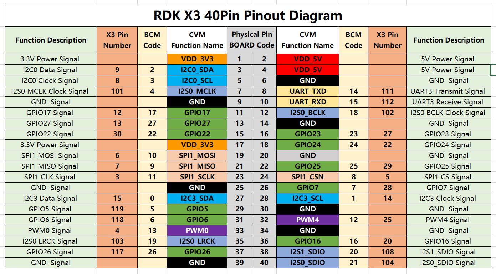

# Pin Configuration and Definition

For the 40-pin on the development board, please refer to the [40-Pin GPIO Definition](#40pin_define) section for interface definitions.

## Pin Multiplexing Configuration

The 40-pin are enabled with default configurations for UART, SPI, I2C, I2S, and other dedicated functions as shown in the [40-Pin GPIO Definition](#40pin_define). If you want to configure specific pins as GPIO, you need to use the `srpi-config` graphical configuration tool.

Note that the `srpi-config` program needs to run in a **full-screen command-line window**. Perform the following steps:

```
sudo srpi-config
```


The `okay` configuration corresponds to dedicated pins, while the `disabled` configuration corresponds to GPIO mode. The configuration takes effect after restarting.

- Select the desired function using the up and down arrow keys, and press Enter to toggle the function ON or OFF. 

- Select Select and Exit with the left and right keys on the keyboard, and confirm with the enter key


## 40-Pin Definition{#40pin_define}

The development board provides a 40-pin standard interface for convenient peripheral expansion. The digital I/Os use a 3.3V voltage level. The pin definitions for the 40-pin interface are as follows:


The development board has silk screen markings on the 40-pin interface to facilitate operation. The locations of PIN1 and PIN40 are as follows:


:::info
The RDK X3 Module provides the 40-pin GPIOs and their definitions as follows:
:::


:::info
The RDK Ultra provides the 40-pin GPIOs and their definitions as follows:
:::
