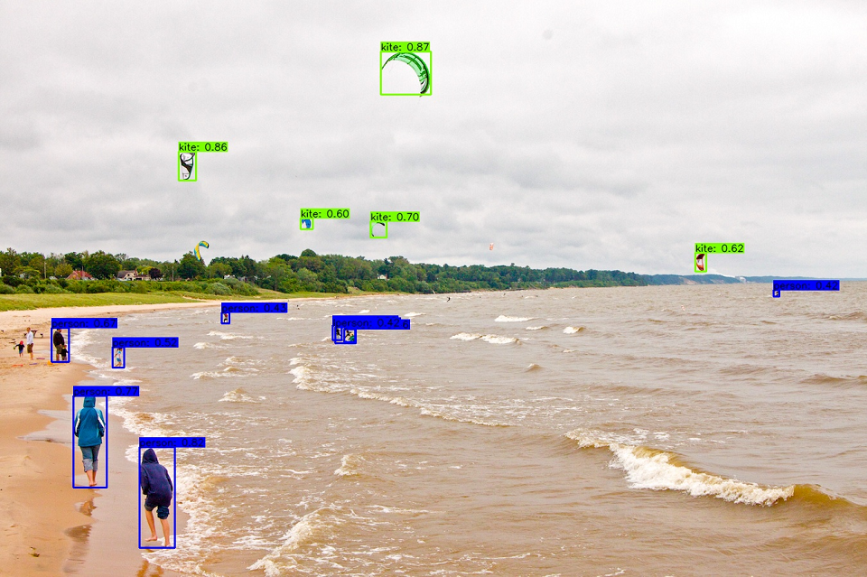
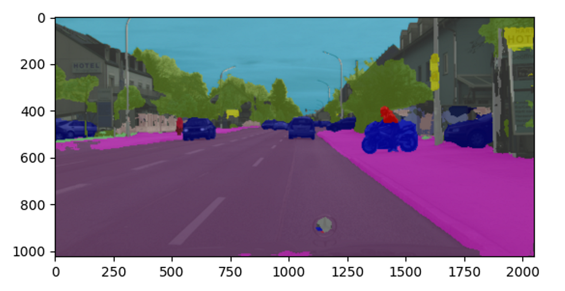

# Static Image Inference

## Image Classification Algorithm - Mobilenet v1

This example mainly implements the following functions:
  1. Load the `mobilenet v1` image classification model
  2. Read the static image `zebra_cls.jpg` as the input of the model
  3. Parse the model output to obtain the classification result of the image

### Running Method

The complete code and test data of this example are installed in the `/app/pydev_demo/01_basic_sample/` directory. Call the following command to run:

```shell
cd /app/pydev_demo/01_basic_sample/
sudo python3 ./test_mobilenetv1.py
```

After successfully running, the classification result of the image will be output as shown below:

```shell
========== Classification result ==========
cls id: 340 Confidence: 0.991851
```

### Explanation of Example Code

- Importing algorithm inference libraries hobot_dnn, numpy, and opencv modules

    ```python
    from hobot_dnn import pyeasy_dnn as dnn
    import numpy as np
    import cv2
    ```

- Model loading
    Call the [load](../pydev_dnn_api.md) interface to load the model file and return a list of `hobot_dnn.pyeasy_dnn.Model` class.

    ```python
    models = dnn.load('../models/mobilenetv1_224x224_nv12.bin')
    ```

    In this example, the input of the `mobilenetv1` model is `1x3x224x224` data with the format `NCHW`. The output is a list of 1000 data, representing the confidence of 1000 categories. The example defines the `print_properties` function to output the input and output parameters of the model:

    ```python
    # print properties of input tensor
    print_properties(models[0].inputs[0].properties)
    # print properties of output tensor
    print_properties(models[0].outputs[0].properties)
    ```

- Data preprocessing

    Example opens the image file `zebra_cls.jpg` containing a zebra, and resizes the image to fit the input size of the model (244 x 224):

    ```python
    # open image
    img_file = cv2.imread('./zebra_cls.jpg')
    # get the input tensor size
    h, w = models[0].inputs[0].properties.shape[2], models[0].inputs[0].properties.shape[3]
    print("input tensor size: %d x %d" % (h, w))
    des_dim = (w, h)
    # resize image to input size
    resized_data = cv2.resize(img_file, des_dim, interpolation=cv2.INTER_AREA)
    ```

    

    Then, convert the image from BGR format to NV12 format, which is compatible with the model input, using the `bgr2nv12_opencv` function:

    ```python
    nv12_data = bgr2nv12_opencv(resized_data)
    ```

- Model inference

    Call the `forward` interface of the [Model](../pydev_dnn_api#model) class for algorithm inference, and then obtain a list of 1000 values representing the predicted probabilities for 1000 categories.

    ```python
    outputs = models[0].forward(nv12_data)
    ```

- Algorithm post-processing

    The output of the algorithm model needs to be post-processed to obtain the desired class, detection box, and other information. In this example, the model output corresponds to 1000 categories, so it needs to be filtered based on confidence to obtain the correct result.

    ```python
    print("=" * 10, "Classification result", "=" * 10)
    np.argmax(outputs[0].buffer)
    # output target id and confidence
    print("cls id: %d Confidence: %f" % (np.argmax(outputs[0].buffer), outputs[0].buffer[0][np.argmax(outputs[0].buffer)]))
    ```

    The correct result when running is:

    ```shell
    ========== Classification result ==========
    cls id: 340 Confidence: 0.991851
    ```


## Object Detection Algorithm - YOLOv3

This example mainly implements the following functions:

1. Load the `yolov3_416x416_nv12` object detection model.
2. Read the static image `kite.jpg` as the input of the model.
3. Analyze the algorithm result and render the detection results.

### How to Run

The complete code and test data of this example are installed in the directory `/app/pydev_demo/06_yolov3_sample/`. Run the following command to execute:

```
cd /app/pydev_demo/06_yolov3_sample/
sudo python3 ./test_yolov3.py
```

After successful execution, it will output the object detection results and save the rendered results to the file `result.jpg`, as shown in the following figure:


## Object Detection Algorithm - YOLOv5{#detection_yolov5}

This example mainly implements the following functions:

1. Load the `yolov5s_672x672_nv12` object detection model.
2. Read the static image `kite.jpg` as the input of the model.
3. Analyze the algorithm result and render the detection results.

### How to Run

The complete code and test data of this example are installed in the directory `/app/pydev_demo/07_yolov5_sample/`. Run the following command to execute:

```
cd /app/pydev_demo/07_yolov5_sample/
sudo python3 ./test_yolov5.py
```

After successful execution, it will output the object detection results and save the rendered results to the file `result.jpg`, as shown in the following figure:


## Image Segmentation Algorithm - UNet

This example mainly implements the following functions:

1. Loading the `mobilenet_unet_1024x2048_nv12` image segmentation model (pre-trained segmentation model for cityscapes).
2. Reading the `segmentation.png` static image as the input of the model.
3. Analyzing the algorithm results and rendering the segmentation results.

### Running Method

The complete code and test data of this example are installed in the `/app/pydev_demo/04_segment_sample/` directory. Use the following command to run:

```
cd /app/pydev_demo/04_segment_sample/
sudo python3 ./test_mobilenet_unet.py
```

After successful execution, the segmentation results of the image will be output, and the segmentation effect image will be output to the `segment_result.png` file, as shown in the following image:
